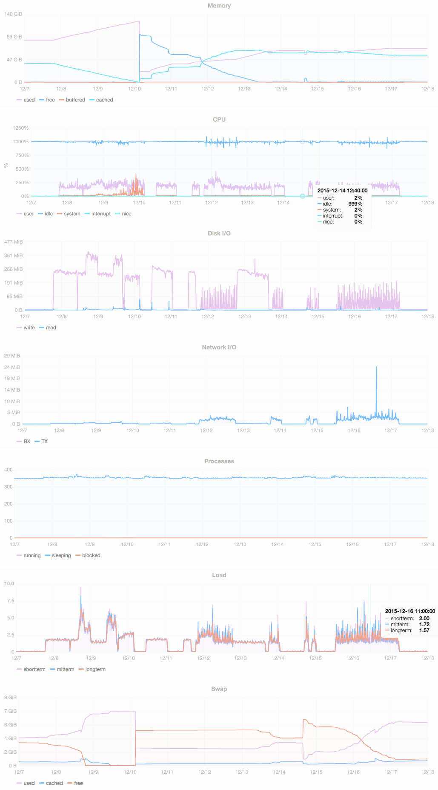

<a name="LTVFPP"></a> 
#Large-scale Technical Validation of Fusepool P3 Platform 
###Deliverable D5.4


###Contents
- [Large-scale Technical Validation of Fusepool P3 Platform](#LTVFPP)      
    - [Document History](#DocumentHistory)
    - [Document Information](#DocumentInformation)
    - [Document Context Information](#DocumentContextInformation)
    - [Quality Assurance / Review](#QualityAssurance)
    - [Official Citation](#OfficialCitation)
    - [Copyright](#Copyright)
    - [Acronyms and Abbreviations](#Acronyms)
- [Executive Summary](#ExecutiveSummary)
- [Introduction](#Introduction)
- [Use Case: Library Keyword Clustering (LKC)](#LKC)
  - [Key Datasets](#KeyDatasets)
    - [DNB Dataset](#DNBDataset)
    - [B3Kat Dataset](#B3KatDataset)
    - [DBpedia Dataset](#DBpediaDataset)
  - [Initial Dataset Connections](#InitialDatasetConnections)
    - [B3Kat - GND](#B3KatGND)
    - [GND - DBpedia](#GNDDBpedia)
  - [Primary Use Case Goals](#PrimaryUseCaseGoals)
  - [Broad Approach](#BroadApproach)
- [Test Infrastructure](#TestInfrastructure)
  - [Estimated Dataset Sizes](#EstimatedDatasetSizes)
  - [Software](#Software)
    - [FP3 Platform Deployment](#FP3PlatformDeployment)
    - [FP3 Platform Configuration](#FP3PlatformConfiguration)
    - [Storage Layer](#StorageLayer)
  - [Hardware](#Hardware)
    - [Memory Requirements](#MemoryRequirements)
- [Data Transformation](#DataTransformation)
  - [Source Dataset Loading](#SourceDatasetLoading)
  - [Use Case Task Details](#UseCaseTaskDetails)
    - [1: Make a graph per GND subject for each B3Kat record](#UseCaseTaskDetails1)
    - [2: Get basic information about each GND subject](#UseCaseTaskDetails2)
    - [3: Get additional GND subject data from DBpedia](#UseCaseTaskDetails3)
    - [4: Get co-occurring concepts from B3Kat](#UseCaseTaskDetails4)
    - [5: Get texts from other B3Kat documents referencing the concept](#UseCaseTaskDetails5)
    - [6: Perform NER on selected document texts](#UseCaseTaskDetails6)
    - [7: Match thesauri concepts to each GND](#UseCaseTaskDetails7)
    - [8: Matching against DBpedia](#UseCaseTaskDetails8)
- [Data Consumption](#DataConsumption)
- [Validation Metrics](#ValidationMetrics)
- [Validation Testing and Results](#ValidationResults)
  - [Interlinking](#ValidationResultsInterlinking)
    - [GND Interlinking](#GndInterlinking)
      - [Transformation Source Data - Preparation and Ingest](#GNDDataIngest)
      - [Transformer Pipeline](#GNDTransformerPipeline)
    - [B3Kat Interlinking](#B3KatInterlinking)
      - [Transformation Source Data - Preparation and Ingest](#B3KatDataIngest)
      - [Transformer Pipelines](#B3KatTransformerPipelines)
        - [Thesauri Concept Linking Pipeline](#ThesauriConceptLinkingPipeline)
        - [B3Kat Subject GND Linking Pipeline](#B3KatSubjectLinkingPipeline)
    - [Supporting Stanbol Enhancement Chains](#SupportingStanbolEnhancementChains)
    - [Interlinking Quality Evaluation](#InterlinkingQualityEvaluation)
      - [A: GND Keyword Clustering](#AGNDKeywordClustering)
      - [B: B3Kat Interlinking](#BB3KatInterlinking)
        - [B1: Interlinking GND - B3Kat](#B1InterlinkingGNDB3Kat)
        - [B2: Interlinking B3Kat titles and keywords with controlled vocabularies](#B2InterlinkingB3Kat)
   - [Platform Stress Testing](#PlatformStressTesting)
   - [System Performance Statistics](#SystemPerformanceStatistics)
- [Conclusions and Future Work](#ConclusionsandFutureWork)
- [Appendix A: GND RDF Description of Hanns Eisler](#AppendixA)
- [Appendix B: Overview Notes on Apache Stanbol](#AppendixB)
  - [Information Extraction for the LKC Use Case](#AppendixBLELUC)
  - [Enhancement Chain](#AppendixBEC)
  - [Enhancement Engines](#AppendixBEE)
  - [Working with Custom Vocabularies](#AppendixBWCV)
  - [Stanbol EntityHub](#AppendixBSEH)
- [Appendix C: Dataset Sources](#AppendixC)
   - [B3Kat](#AppendixCB3Kat)
   - [GND](#AppendixCGND)
   - [STW](#AppendixCSTW)
   - [TheSoz](#AppendixCTheSoz)
   - [IPTC](#AppendixCIPTC)
   - [EuroVoc](#AppendixCEuroVoc)

----------
<a name="DocumentHistory"></a> 
#### Document History ####

| Ver. | Name | Date | Remark |
| :---: | :--- | :---: | :--- |
| v0.0 | Carl Blakeley, Milos Jovanovik | 08.06.2015 | Initial draft |
| v0.1 | Milos Jovanovik, Carl Blakeley, Adrian Gschwend, Rupert Westenthaler, Johannes Hercher, Reto Gmür | 26.06.2015 | Pre-review version |
| v0.2 | Johannes Hercher, Milos Jovanovik, Carl Blakeley, Adrian Gschwend, Rupert Westenthaler, Reto Gmür | 10.07.2015 | Reviewed version |
| v0.3 | Johannes Hercher, Milos Jovanovik, Carl Blakeley, Adrian Gschwend, Rupert Westenthaler | 18.12.2015 | Test result additions - Pre-review version | 
| v0.4 | Rupert Westenthaler, Johannes Hercher, Milos Jovanovik, Carl Blakeley, Adrian Gschwend  | 22.12.2015 | Test result additions - Reviewed version |

<a name="DocumentInformation"></a> 
#### Document Information ####

- Deliverable Nr Title: D5.4 Large-scale technical validation of Fusepool P3 platform
- Lead: Milos Jovanovik (OGL)
- Authors: Milos Jovanovik, Carl Blakeley (OGL), Adrian Gschwend (BUAS), Reto Gmür (BUAS), Rupert Westenthaler (SRFG), Johannes Hercher (Freie Universität Berlin)
- Publication Level: Public

<a name="DocumentContextInformation"></a> 
#### Document Context Information ####

 - Project (Title/Number): Fusepool P3 (609696)
 - Work Package / Task: WP5 / T5.6
 - Responsible person and project partner: Milos Jovanovik (OGL)

<a name="QualityAssurance"></a> 
#### Quality Assurance / Review ####

- 1st reviewer: Jakob Frank (SRFG)
- 2nd reviewer: Luigi Selmi (BUAS)
- 3rd reviewer: Danilo Giacomi (NET7)
- 4th reviewer: John Pereira (SRFG)

<a name="OfficialCitation"></a> 
#### Official Citation ####
Fusepool-P3-D5.4

<a name="Copyright"></a> 
#### Copyright ####

This document contains material, which is the copyright of certain Fusepool P3 consortium parties. This work is licensed under the Creative Commons Attribution 4.0 International License. To view a copy of this license, visit http://creativecommons.org/licenses/by/4.0/.

<a name="Acronyms"></a> 
#### Acronyms and Abbreviations ####

| Acronym | Description |
| --- | :--- |
| DoW | Description of Work |
| DDC | Dewey Decimal Classification |
| ECC | Error correcting code |
| NER | Named entity recognition |
| NEL | Named entity linking |
| NLP | Natural language processing |
| FP3 | Fusepool P3 |
| FAM | Fusepool Annotation Model |
| FST | Finite state transducer |
| GND | Gemeinsame Normdatei (Integrated Authority File) |
| LLC | Library of Congress Classification |
| Lccn| Library of Congress classification number|
| LDP | Linked Data Plattform |
| POS | Part of speech |
| SSD | Solid-state drive |

<a name="ExecutiveSummary"></a> 
## Executive Summary ##

This document details the work performed for Deliverable D5.4 / Task 5.6 "Large-scale technical validation of the Fusepool P3 platform".

The large scale testing is based on a central use case, Library Keyword Clustering, in which the main processing steps are:

* Aggregation of book subject information from library catalogues, authority files and DBpedia
* Analysis of co-occurrences of book subject concepts and keyword clustering
* Analysis of the words/terms used in conjunction with a subject identifier (word contexts) to find related entities using Named Entity Recognition (NER) and Named Entity Linking (NEL)

The aim is to demonstrate large scale aggregation and transformation of information distributed across various locations, through a unified rerunnable workflow provided by the FP3 platform and which requires no end-user intervention once configured. Automated Linked Data generation and publishing through FP3 would be a significant improvement on the currently cumbersome, labour intensive manual subject indexing by librarians.

The Library Keyword Clustering (LKC) use case centres on the interlinking of three large datasets: two library catalogues - the [B3Kat](https://lod.b3kat.de/) catalogue and the [GND Authority File of the German National Library](http://www.dnb.de/EN/Standardisierung/GND/gnd.html) - and [DBpedia](http://dbpedia.org). 

The seed dataset, B3Kat, contains approximately 26 million bibliographic records. The three core datasets combined total around 2 billion triples.

###Key Findings###

####Interlinking Quality####

The validation testing processed all B3Kat records without an assigned GND classification, approximately 143,000 in total, to link them with concepts from DBpedia, the STW, IPTC, and Social Sciences thesauri, and to automatically assign GND subject classification codes. 

The main goals were to evaluate the reliability of the platform for generating interlinkings to GND Authority files, specifically to assess if the Dictionary Matcher works effectively to link plain texts to a corresponding GND identifier, and to determine if the platform can generate useful links from B3Kat records to controlled vocabularies.

The platform outperformed expectations (70-80%) by finding 100% of the pre-existing GND links of 250 records. The results indicate it is potentially very useful for generating GND IDs in bibliographic records that currently have only plain text (but controlled) keywords. Approximately 80% of the generated links to subject keywords are "useful", demonstrating that the platform is capable of suggesting a valuable amount of useful links to other controlled vocabularies. Overall, the platform provides a viable automated subject indexing tool to support manual indexing by librarians.

####Platform Performance####

In addition to the 143,858 B3Kat records, 2 million augmented GND authority files (uploaded as 20,000 transformation input documents combining 100 authority files per input document) have been enriched on the platform. The transformation speed appears linear (O(n)), with the processing time of the last of the 2 million GNDs taking no longer than for the first GNDs.

The stress testing showed that the platform does not exibit any performance slowdown when storing and processing large amounts of data over a period of time, maintaining linear processing speed and consistent transformer pipeline performance. The total stress test processing took ~149 hours and the amount of data POSTed to the platform's LDP containers totaled to 10.4 GB.

####System Performance

Analysis of the system performance reveals that the system was at no point even close to high load. At most 2 of 12 available cores were used in parallel and even with all the large data sets loaded into Virtuoso, RAM usage was between 50-70%. All data sets were fully loaded into memory which is confirmed by the lack of read disk I/O in the performance statistics. During processing the only I/O activity on disk is write to store the newly generated data persistently.

<a name="Introduction"></a> 
## Introduction ##

The DoW for the Fusepool P3 project describes the main task of this deliverable as: 

*"T5.6 Technical validation of Fusepool Linked Data Platform: implementation will be tested through the large-scale real life use cases defined in WP1 to ensure that an industry-strength Linked Data platform is created...".*

In selecting use cases for large scale testing, our choice was influenced by two criteria: 

 - the test data should be sufficiently large to adequately test the ability of the FP3 platform to handle large data volumes;
 - processing of the test data should exercise as much of the platform as possible.

The use cases driving the development of the FP3 Platform have been defined as part of WP1 and are described in the Deliverable 1.1 report, "[D1.1 Use cases and data specified, data modelled and prepared](https://github.com/fusepoolP3/p3-wp1-deliverables/blob/master/d11-deliverable.md)". From these, we selected one use case to form the basis of the large scale testing of the platform:

 - [Large Scale Validation Use Case: Library Keyword Clustering](https://github.com/fusepoolP3/p3-wp1-deliverables/blob/master/d11-deliverable.md#user-content-large-scale-validation-use-case-library-keyword-clustering)

This use case focusses on exercising the bulk import and bulk transformation (annotation) features of the platform, along with the ability to handle large datasets. The components of the FP3 platform tested include:

 - the Virtuoso backend with its bulk load, quad store and LDP capabilities - via the bulk loading of source RDF datasets
 - the FP3 Transforming LDP Proxy - via the bulk deposit, loading and transformation (annotation) of derived RDF documents
 - the FP3 Transformer API (primarily through annotating rather than extracting transformers), FP3 Pipelining and Stanbol Enhancers - via the bulk annotation process

<a name="LKC"></a> 
## Use Case: Library Keyword Clustering (LKC) 

The "Linked Keyword Clustering" (LKC) use case is described in detail in the WP1 [Deliverable 1.1 report](https://github.com/fusepoolP3/p3-wp1-deliverables/blob/master/d11-deliverable.md#user-content-large-scale-validation-use-case-library-keyword-clustering). The main goal is to help libraries in data analysis and interlinking of distributed information. The use case is intended to support resource intensive subject indexing, but can also be used to build future search interfaces. 

LKC supports libraries in data analysis and interlinking to (a) collect complementary information, (b) compute keyword co-occurrences, and (c) to build word contexts of library keywords. The intention is that these clusters could be harnessed to suggest additional search terms or related documents to the end users, and also to gain complementary terms during subject indexing. LKC provides an aggregated dataset that is enriched with co-occurrence links, and which is extremely difficult to create without semantic technologies running on high-end hardware. Future plans could focus on workflow maintenance, e.g. including more resources and triggered runs on updates within the connected datasets.

Below, we provide a more technical overview of the LKC use case.

<a name="KeyDatasets"></a> 
### Key Datasets
The LKC use case centres on the interlinking of three large RDF datasets:  two library catalogues - the [GND Authority File of the German National Library](http://www.dnb.de/EN/Standardisierung/GND/gnd.html) and the [B3Kat](https://lod.b3kat.de/) catalogue - and [DBpedia](http://dbpedia.org).

<a name="DNBDataset"></a> 
####DNB Datasets
The German National Library (DNB) is dedicated to collecting and describing all content published in Germany in order to make cultural heritage accessible in the long term. The [Linked Data Service of the German National Library](http://www.dnb.de/EN/Service/DigitaleDienste/LinkedData/linkeddata_node.html) has made their entire dataset (i.e. [DNB catalogue](http://datendienst.dnb.de/cgi-bin/mabit.pl?cmd=fetch&userID=opendata&pass=opendata&mabheft=DNBTitel.ttl.gz) and the national [Authority File (GND)](http://datendienst.dnb.de/cgi-bin/mabit.pl?cmd=fetch&userID=opendata&pass=opendata&mabheft=GND.ttl.gz)) available as Linked Data.

###### Catalogue
The catalogue contains bibliographic descriptions for both print and electronic materials. The DNB catalogue contains 11.953.014 records as of 13th May 2015 and is available free of charge through the [Linked Data Service of the German National Library](http://www.dnb.de/EN/Service/DigitaleDienste/LinkedData/linkeddata_node.html). The catalogue is roughly 1.2 GB.

###### GND 
The [Integrated Authority File](http://en.wikipedia.org/wiki/Integrated_Authority_File) (German: Gemeinsame Normdatei) or GND is the national authority file for the unique identification of entities (e.g. personal names, subject headings, corporate bodies, etc.). As a controlled vocabulary, it is used for the organization of alternative labels for entities, as well as their semantic relations. According to its broad application, the GND is the most important vocabulary to describe publications' contents in Germany and German-speaking countries in Europe. It is mainly used by libraries, but increasingly also by archives and museums. GNDs are hosted by the German National Library (Deutsche National Bibliothek) and maintained in co-operation with various library networks.
According to [LOD Stats](http://stats.lod2.eu/rdfdocs/157), it contains 124.402.922 triples, about 36.575.972 entities, organized in 48 classes and 189 properties. It has a size of around 10GB (decompressed). 

<a name="B3KatDataset"></a> 
####B3Kat Dataset
[B3Kat](http://www.b3kat.de/) is the "common union catalogue" of [BVB](http://www.bib-bvb.de/) (Bavarian Library Network) and [KOBV](http://www.kobv.de/) (Cooperative Library Network Berlin-Brandenburg). The [B3Kat Linked Open Data Service](https://lod.b3kat.de/) provides several cataloguing services and aggregates library data of 180 academic libraries in Bavaria, Berlin and Brandenburg, describing roughly 26 million titles. 

The [B3Kat RDF data dump](https://lod.b3kat.de/download) contains about 890 million RDF triples in 7.7GB of data.

Data contained in the dataset is about all publications (textbooks, dissertations, journals, maps, audio recordings, etc.) acquired by the 180 member libraries. In contrast to the DNB catalogue (see above), these publications don't have to be published in Germany. Moreover, the dataset contains descriptions about libraries and their locations. A sample record can be seen here: <https://lod.b3kat.de/page/title/BV023184541>.

<a name="DBpediaDataset"></a> 
####DBpedia Dataset
The [DBpedia](http://dbpedia.org) dataset describes 4.58 million entities, including 1,445,000 persons, 735,000 places, and 241,000 organizations. The dataset features labels and abstracts for these entities in up to 125 different languages; 25.2 million links to images and 29.8 million links to external web pages. It consists of 3 billion RDF triples, out of which 580 million were extracted from the English edition of Wikipedia, 2.46 billion were extracted from other language editions. DBpedia is connected with other Linked Datasets by around 50 million RDF links. [DBpedia dumps](http://wiki.dbpedia.org/Downloads) in 119 languages are available on the DBpedia download server. Assuming only the English and German localized datasets are used for LKC, we estimate the DBpedia corpus in this application context will contribute of the order of 1 billion triples.


<a name="InitialDatasetConnections"></a> 
### Initial Dataset Connections

At the outset, before any interlinking by the FP3 framework, minimal connections existed between the source datasets. These minimal base connections, which provided the initial basis for richer interlinking and enrichment, are outlined below.

<a name="B3KatGND"></a> 
#### B3Kat - GND
The B3Kat dataset links to the GND corpus through GND IDs held as `dcterms:subject` values. 

The home page of the [B3Kat Linked Open Data Service](https://lod.b3kat.de/) includes a link for displaying an [example title](https://lod.b3kat.de/example). From this, it can be seen that the `dcterms:subject` property contains a number of subject identifiers, using several classification schemes including [GND](http://www.dnb.de/EN/Standardisierung/GND/gnd.html), [DDC](http://en.wikipedia.org/wiki/Dewey_Decimal_Classification) and [RVK](https://www.uni-erfurt.de/en/bibliothek/library-erfurt/research/classification-rvk/). The LKC use case makes reference to Hanns Eisler's "Deutsche Sinfonie" <https://lod.b3kat.de/page/title/BV001289953> as a central example - again the `dcterms:subject` property uses subject identifiers spanning the GND, DDC, [LLC](http://en.wikipedia.org/wiki/Library_of_Congress_Classification) and RVK schemes.

<a name="GNDDBpedia"></a> 
#### GND - DBpedia

The GND dataset includes links to DBpedia resource descriptions for many items, through `owl:sameAs` properties. For example, the GND entry for Hans Eisler includes:

    <rdf:Description rdf:about="http://d-nb.info/gnd/118529692">
        <rdf:type rdf:resource="http://d-nb.info/standards/elementset/gnd#DifferentiatedPerson" />
        <foaf:page rdf:resource="http://de.wikipedia.org/wiki/Hanns_Eisler" />
        <owl:sameAs rdf:resource="http://dbpedia.org/resource/Hanns_Eisler" />
        ...
        <gndo:surname>Eisler</gndo:surname>
        ...
    </rdf:Description>
 
<a name="PrimaryUseCaseGoals"></a> 
###Primary Use Case Goals

Beyond providing a basis for large scale testing of the FP3 platform, the main goal from the user's perspective of this application is to make GNDs identifiers more usable, and to enhance retrieval of publications in libraries. More specifically, this leads to the following sub-goals:

 - **Add context around a GND concept, and identify related concepts**:
  - Cluster GND identifiers based on their degree of co-occurrence in library records. 
  - Aggregate information about GND identifiers located in other datasets, i.e. textual descriptions, geo-information, images from DBpedia.
 - **Enrich GND concepts by harnessing FP3 NER and dictionary matching capabilities**: 
  - Find co-occurring entities (places, persons, organizations ...) for each subject concept.
  - Count-of-Occurence-Analysis for mentioned entities, e.g. to create tag-clouds.
 - **Enrich library records**: Recognize identifiers from catalogue records using the FP3 Dictionary Matcher, to identify text strings in the library records that are not yet linked to their corresponding GND identifier.
 
<a name="BroadApproach"></a> 
### Broad Approach

In order to achieve these goals, the following technical steps are necessary:

- Import the RDF datasets into the FP3 Platform
- Pre-process the RDF according to the use case requirements
- Enrich the RDF datasets using the FP3 Platform
- Host the enriched datasets using the FP3 Platform, making them available via SPARQL and LDP

<a name="TestInfrastructure"></a> 
## Test Infrastructure

<a name="EstimatedDatasetSizes"></a> 
### Estimated Dataset Sizes

The source datasets total approximately 2 billion triples:

| Source dataset | Approximate size |
| :-- | :-- |
| GND | 124 million triples |
| B3Kat | 890 million triples |
| Dbpedia | 1 billion triples (assuming only the English and German localized datasets and associated ontologies are loaded) |

We estimated that, if transformed in full, the resultant aggregated data would total under 1 billion triples - a Turtle mockup of the desired output by the end users suggested that there would be ~200 triples per subject. Assuming the source data covers approximately 3 million authors, the output data would be of the order of 600 million triples held in LDP storage.

The estimated total data corpus size of 3 billion triples, together with past experience of the core software components to be exercised, was then used as the basis for specifying the test platform hardware.

<a name="Software"></a> 
###Software

<a name="FP3PlatformDeployment"></a> 
#### FP3 Platform Deployment

For ease of deployment, the FP3 test platform was composed from Docker images.

 - [FP3 Platform reference implementation - Docker image details](https://github.com/fusepoolP3/p3-platform-reference-implementation)
 - [VOS - Docker image details](https://github.com/fusepoolP3/virtuoso-docker)
 
No special components were used for the large scale validation.

<a name="FP3PlatformConfiguration"></a> 
#### FP3 Platform Configuration

The configuration for the large scale validation consists of several transforming LDPCs
configured to use the [Literal Extraction Transformer](https://github.com/fusepoolP3/p3-literal-extraction-transformer)
to process uploaded RDF files (enriched GND instances or [B3Kat](http://www.bib-bvb.de/web/b3kat) data).

__Enriched GND Configuration:__

The enriched GND instances, the result of the pre-processing steps 1-5 (described later), are ingested through a transforming LDPC responsible for enriching those data with extracted named entities as well as links to IPTC, TheSoz and STW.

To achieve this, processing is first done by a [Literal Extraction Transformer](https://github.com/fusepoolP3/p3-literal-extraction-transformer)
configured to read literal values from `nif:isString`, `dbo:abstract`, `gnd:publication` and `gnd:biographicalOrHistoricalInformation`. Those literal values are collected per language, concatenated and sent to an Apache Stanbol Transformer configured to extract named entities and find mentions of entities from IPTC, TheSoz and STW. The text analysis results encoded using the [Fusepool Annotation Model](https://github.com/fusepoolP3/overall-architecture/blob/master/wp3/fp-anno-model/fp-anno-model.md) (FAM) are used by the Literal Extraction Transformer to enrich the processed GND entities.

Extracted named entities are stored using `fam:person-ne-reference` for Persons, `fam:organization-ne-reference` for Organizations, `fam:location-ne-reference` for Locations and `fam:named-entity-reference` for other detected named entity types. Entity mentions detected for IPTC, TheSoz or STW are linked by using `fam:entity-reference`. This means that GND instances will have values for those properties representing the information extraction results for the literal values of the input properties.

__B3Kat Configuration:__

For the processing of B3Kat instances, a similar processing workflow of a Literal Extraction Transformer coupled with a Stanbol Transformer is used. For validation purposes the use case partner requested processing of B3Kat resources with two different configurations.

1. Enriching B3Kat data with Named Entity Extraction, IPTC, TheSoz and STW: This configuration uses the title, sub-title and subjects as input and sends it to the Apache Stanbol Transformer configuration configured for the mentioned features. This is the same Stanbol Transformer also used to process text extracted from the enriched GND entities.

2. Linking B3Kat subject annotation with GND: This configuration aims to link those ~40% of B3Kat instances that were not manually tagged with GND instances but only with string keywords. For that, a Stanbol Transformer was configured that links against the current GND version. As input, only `dc:subject` values of B3Kat instances are used. (Note: GND subjects for B3Kat are stored in `dct:subject`; `dc:subject` is used for string subjects).

The first validates if data available in B3Kat can be used to suggest useful subjects. The second validates if string subjects can be linked with GND.

__Information Extraction Configuration:__

This section describes the configuration used for extracting information from concatenated literal values sent by the Literal Extraction Transformer. As this content is mainly constituted of single labels and only partially written text (e.g. DBpedia abstracts of GND instances with a link ot DBpedia) the information extraction task is especially hard.

The large scale validation includes Named Entity Recognition (NER). However as the user NER models were trained mainly on news texts the performance on concatenated labels was expected to be poor. For the test the German NER model provided by the [IXA Pipe NERC](https://github.com/ixa-ehu/ixa-pipe-nerc/) was used. All IXA Pipe NERC models are available in the [Fusepool Stanbol Launcher](https://github.com/fusepoolP3/p3-stanbol-launcher).

The large scale validation uses four datasets for Entity Linking. This means that mentions of entities are searched for in processed text. If such mentions are found the document is linked with that entity. Enriched GND resources are linked with the following three vocabularies. 

1. The [Thesaurus for the Social Sciences](http://www.gesis.org/en/services/research/thesauri-und-klassifikationen/social-science-thesaurus/) ([TheSoz](http://www.semantic-web-journal.net/sites/default/files/swj279_2.pdf)).
2. The [IPTC](https://iptc.org/) media topics [thesaurus](https://iptc.org/standards/media-topics/)
3. The [STW Thesaurus for Economics](http://zbw.eu/stw/versions/latest/download/about.en.html).

For processing the B3Kat `dc:subject` values, linking against GND was used in addition to those three vocabularies.

As part of the large scale validation pre-indexed versions of all those vocabularies were created by Fusepool and are included in the default [Fusepool Stanbol Launcher](https://github.com/fusepoolP3/p3-stanbol-launcher). Because of the size of the dataset the index data of GND are not included but need to be downloaded and installed manually.

The predefined configuration includes three linking modes: 

1. Named Entity Linking: This mode requires NER (e.g. IXA Pipe Nerc). Linking will only try to link Named Entities detected by the NER component with the vocabulary. This mode is most interesting for GND with its 11+ millions entities.
2. Linkable Token Linking: This is the default mode and tries to link only Nouns and Noun Phrases.
3. Plain Linking Mode: The mode used for the Large Scale validation and the best choice in cases where the input text contains a lot of none natural language text (e.g. list of words, tables, ...)
 
<a name="StorageLayer"></a> 
#### Storage Layer

Although Marmotta has provided the RDF storage for much of the FP3 development, Virtuoso Open Source Edition (VOS) was chosen as the storage layer, to provide the quad store, LDP server and SPARQL endpoints. Evaluations tests have found Virtuoso to be scalable to 10 billion+ triples. Virtuoso Commercial Edition was not considered necessary for the calculated use case dataset sizes. VOS supports multiple cores, so a single server instance running on a single machine is suitable. The GND, B3Cat and DBpedia datasets were loaded directly into the Virtuoso quad store.

<a name="Hardware"></a> 
### Hardware

The test platform comprises a dedicated server, not a virtual machine, with the following specification:

 - 2 x Intel Xeon E5 2620V2, 2 x (6 x 2.10 GHz)
 - 128 GB buffered ECC RAM
 - 1000 GB SSD (Samsung 840 EVO)
 - Ubuntu 14.04

<a name="MemoryRequirements"></a> 
####Memory Requirements

Based on the anticipated size of the datasets and generated data, we estimated the amount of RAM required to be roughly as follows:

 - Virtuoso 7 typically requires 10GB per billion triples (10 bytes per quad), depending on how well the particular datasets compress for storage. 32GB RAM for Virtuoso was considered sufficient for ~3 billion triples. In general, memory is more important than disk storage, as once the database is 'warm', i.e. the database working set is in memory, then disk access is minimized.
 - Stanbol's memory requirements were estimated to be ~4GB. For creating Solr indexes with the Entityhub Indexing Tool, Jena TDB is used as the source for indexing. Jena TDB is not required at runtime. The entity labels are held in memory, encoded in a FST (~300MB for all DBpedia's English labels).
 - Other Fusepool Transformers memory requirements are limited to in-memory caching of currently processed items. Their memory requirement are far below 1GB.

<a name="DataTransformation"></a> 
##Data Transformation
<a name="SourceDatasetLoading"></a> 
### Source Dataset Loading

A prerequisite for transforming all this data was that the source datasets be loaded into the test LDP server. Virtuoso incorporates a bulk loader for importing large RDF datasets.  Although B3Kat and DBpedia provide public SPARQL endpoints (the German National Library does not make a SPARQL endpoint for GND catalogue), it was not thought feasible (or responsible) to rely on these endpoints for such large scale processing.

<a name="UseCaseTaskDetails"></a> 
### Use Case Task Details

The use case description provided by the WP1 Deliverable 1.1 report lists the main processing steps necessary to provide the desired enrichment and interlinking. These are re-iterated again below, but with a focus on the technical details of realizing the data transformations.

Some of the use case tasks, primarily preparation of the input data in tasks 1 - 5, are performed by scripts. Tasks 6 - 8 are performed by the FP3 platform itself and constitute the core of the validation testing. These latter tasks comprise NER on selected document texts, matching thesauri concepts to each GND and matching against DBpedia using a combination of the following FP3 transformers: the Stanbol Enhancer Transformer, the Dictionary Matching Transformer and the Pipeline Transformer. These transformers are detailed in the D3.1 Deliverable Report. Appendix B below contains introductory notes on Apache Stanbol.
 
<a name="UseCaseTaskDetails1"></a> 
####1: Make a graph per GND subject for each B3Kat record

Approximately half of B3Kat's 26 million bibliographic records about books include links to between 1 and 10 related GND subject identifiers. 

See for example Hanns Eisler’s Deutsche Sinfonie https://lod.b3kat.de/page/title/BV001289953. Using the [B3Kat SPARQL endpoint](https://lod.b3kat.de/doc/de/sparql-endpoint/):

     SELECT * WHERE { 
       <http://lod.b3kat.de/title/BV001289953> 
         dc:title ?title ;
         dct:subject ?subject 
         filter regex(str(?subject), "d-nb.info/gnd")
     }
    
returns
    
| title | subject |
| :-- | :-- |
| Hanns Eislers "Deutsche Sinfonie" | http://d-nb.info/gnd/118529692 |
| Hanns Eislers "Deutsche Sinfonie" | http://d-nb.info/gnd/4222905-4  |

For each GND ID listed as a `dct:subject` in a B3Kat record, a graph is created by a CONSTRUCT query, using the GND ID as the graph URI.

<a name="UseCaseTaskDetails2"></a> 
####2: Get basic information about each GND subject

B3Kat contains only GND IDs and no additional information from the GND authority file is available. However, this information is available in the GND RDF dumps. For instance, alternative labels, geo information, semantic relations (broader, narrower, related), subject categories, mappings to Wikipedia and DBpedia. (See also Appendix A for an example of a typical entry from the GND dataset.)

Each graph created in step 1 is augmented with information about the subject concept extracted from the subject description in the GND dataset.

<a name="UseCaseTaskDetails3"></a> 
####3: Get additional GND subject data from DBpedia

Many GND concepts have a link to DBpedia.  See Appendix A for an example;  the description of Eisler includes:

    <owl:sameAs rdf:resource="http://dbpedia.org/resource/Hanns_Eisler" /> 

This link is used to fetch additional data, such as: `foaf:depiction`, `dbpedia-owl:thumbnail`, `dc:description`, `rdfs:comment`, `dbpedia-owl:abstract`, `dcterms:subject`, etc., to augment each base graph of step 1.

<a name="UseCaseTaskDetails4"></a> 
####4: Get co-occurring concepts from B3Kat

For a given GND ID we can query co-occurring subject headings (GND IDs, LcSH) and classification codes (RVK, DDC, Lccn, etc.) from records of the B3Kat at its [SPARQL endpoint](https://lod.b3kat.de/doc/de/sparql-endpoint/).

The goal is to compute the co-occurrence of a GND to other GNDs and subject identifiers from other subject vocabularies (RVK, DDC, Lccn). The co-occurrence of concepts can be computed directly and attached to the GND graphs from step 1. This results in many additional triples, but we limit the addition of co-occurrence relation triples to a particular GND graph (e.g. for Hanns Eisler) at a certain degree of co-occurrence, e.g. 5-10%.

We can retrieve identifiers that appear in the same context/record with a GND ID. All identifiers are marked as co-occurrent and added to the GND ID graph (cf. step 1): 

    SELECT ?record ?cosubjectLabel ?cosubjectUri ?colccn ?coisbn ?cocreator
    WHERE { 
    ?record ?p <http://d-nb.info/gnd/118529692> . #- Hanns Eisler
      OPTIONAL { ?record dc:subject ?cosubjectLabel }
      OPTIONAL { ?record dct:subject ?cosubjectUri }
      OPTIONAL { ?record bibo:lccn ?colccn }
      OPTIONAL { ?record bibo:isbn ?coisbn }
      OPTIONAL { ?record marcrel:aut ?cocreator }
    }
   
Additionally, we count how often a concept co-occurs with the given GND ID to compute the distance measure. The distance `d` of a base concept `Cb` (i.e. Hanns Eisler) to a co-occurrent concept `Cx` is computed as the percentage of the total record count having `Cb`.

    SELECT (count(*) AS ?totalNumOfRows)
    WHERE { 
    ?record ?p <http://d-nb.info/gnd/118529692> ;  #- Hanns Eisler
            dct:subject ?cosubjectUri .
          }

returns

| totalNumOfRows |
| :-- |
| 2279 |

Using the total count of rows for a certain GND ID, we compute the `d` argument of the GND ID graph for `Hanns Eisler` with this information.

    SELECT ?cosubjectUri (COUNT(?record) AS ?recordCount)
    WHERE { 
    	 ?record ?p <http://d-nb.info/gnd/118529692> ;
            dct:subject ?cosubjectUri . #- Hanns Eisler
          }
          GROUP By ?cosubjectUri
          ORDER BY DESC(?recordCount)
          # returns:  
          #<http://lod.b3kat.de/ssg/9.2>		595 * 100 / 2279 => 26% 
          #<http://lod.b3kat.de/rvk/LU91850>	226 * 100 / 2279 => 10%
          #<http://d-nb.info/gnd/118529692>	165 * 100 / 2279 => 7%

returns

| cosubjectUri | recordCount |
| :-- | :-- |
| <http://lod.b3kat.de/ssg/9.2> | 595 |
| <http://lod.b3kat.de/rvk/LU91850> | 226  |
| <http://d-nb.info/gnd/118529692> | 165  |

from where we can compute

| cosubjectUri | distance `d` |
| :-- | :-- |
| <http://lod.b3kat.de/ssg/9.2> | 595 * 100 / 2279 => 26% |
| <http://lod.b3kat.de/rvk/LU91850> | 226 * 100 / 2279 => 10% |
| <http://d-nb.info/gnd/118529692> | 165 * 100 / 2279 => 7% |

<a name="UseCaseTaskDetails5"></a> 
####5: Get texts from other B3Kat documents referencing the concept

For a given GND concept, we search for other documents which reference the concept in some way and extract their title and subtitle as the basis for NER.

e.g. Find the title and subtitle of documents which reference Hanns Eisler:

    PREFIX isbd: <http://iflastandards.info/ns/isbd/elements/>

    SELECT DISTINCT ?s ?title ?subtitle
     WHERE { 
      ?s ?p <http://d-nb.info/gnd/118529692> ; # - Hanns Eisler 
     dc:title ?title ;
     optional { ?s isbd:P1006 ?subtitle }
    } LIMIT 500
    
<a name="UseCaseTaskDetails6"></a> 
####6: Perform NER on selected document texts

At this point, the graphs created and populated by steps 1 - 5 provide the base context for enrichment and interlinking by the FP3 platform. By an ETL process external to the platform (node.js scripts), each graph (1 per GND concept) is used to generate an RDF document (of somewhere between 100 - 1000 triples) which is deposited in a common transforming LDPC. The transforming LDPC is linked to an FP3 pipeline transformer combining the required transformers.

For each RDF document, we use the contained titles of books related to the core concept, and the DBpedia abstract for the core concept, as the input for NER analysis.

#####NER for LKC - Implementation

Stanbol supports a number of NLP/NER frameworks including Stanford NLP and OpenNLP. For this use case, OpenNLP will be used as it provides a basic NER model that can detect persons, organizations and locations in German language texts. While there is also a German model for Stanford NLP, this is only available for an older software version that is not compatible with the Stanford/Stanbol integration. As there are also English books to be processed, OpenNLP will be configured with both German and English language models.

In common with most of the other Stanbol enhancement engines, OpenNLP accepts plain text. The [Literal Extraction Transformer]( https://github.com/fusepoolP3/p3-literal-extraction-transformer) provides the plain text input to OpenNLP, by combining the Literal Extraction and Stanbol transformers in a pipeline. The Literal Extraction Transformer can be configured to iterate over specific literal predicates in particular languages, concatenating the text for the same language and emitting plain text.

#####NER for LKC - Expectations

Publicly available NER models typically include support for persons, organizations and places and are trained based on news text corpora. In-domain (meaning when applied to news texts other than the training set) those systems typically reach F1 measures above 90%. However when applied to other types of texts the performance can drop drastically.

Input texts for the LKC domain are very different from news texts. Texts are essentially concatenated titles and sub-titles, meaning that the texts do not contain full sentences nor are there sentences connected to previous sentences.

Because of that we expected available NER models to perform very badly on the data of this use case. Nevertheless, in spite of initial reservations about the anticipated quality of expected NER results, we believed at the outset that the use case was fit for purpose for validating that the platform can handle large amounts of data.

To obtain better results, it would be necessary to train specific NER models based on a training set on the LKC texts. Experience on other datasets suggests that one can train a reasonably good model with about 3000 manually annotated entities per entity type. We consider training an LKC-specific model to be outside the scope of this validation task.

Extracted Named Entities are represented in the results by using the [Entity Mention Annotation](https://github.com/fusepoolP3/overall-architecture/blob/master/wp3/fp-anno-model/fp-anno-model.md#entity-mention-annotation) as defined by the Fusepool Annotation Model (FAM). The [Literal Extraction Transformer]( https://github.com/fusepoolP3/p3-literal-extraction-transformer) consumes those annotations and converts them to explicit triples to be added to the enriched LKC dataset.

<a name="UseCaseTaskDetails7"></a> 
####7: Match thesauri concepts to each GND

In this step, *entity linking* against each GND ID is performed, with the aim of detecting mentions of GND IDs in the titles and sub-titles of the LKC data. If the GND ID has a `owl:sameAs` relation to DBpedia, the process also considers the `dbpedia-owl:abstract` or `rdfs:comment` property of the linked DBpedia page to find additional concepts that appear in the context of the base GND ID. The mentioned GND IDs are represented in the results by using [Entity Annotation](https://github.com/fusepoolP3/overall-architecture/blob/master/wp3/fp-anno-model/fp-anno-model.md#entity-annotation) as defined by the Fusepool Annotation Model (FAM).

NOTE: This is different from the *Named Entity Recognition* in step 6. *NER* detects types of entities in the text without the need of any controlled vocabulary. This means that NER can detect new/unknown entities. *Entity linking* works based on a controlled vocabulary - in this case the GND. It uses the names (preferred and alternate) as input and looks for mentions of those in the text. If it finds such a mention it links the according entity with that mention in the text.

The Fusepool platform provides several entity linking implementations. Options include:
 
 * Dictionary Matching Transformer
 * Stanbol Entityhub Linking Engine
 * Stanbol FST Linking Engine 

For this use case we use the [FST Linking Engine](http://stanbol.apache.org/docs/trunk/components/enhancer/engines/lucenefstlinking) of Apache Stanbol as this one is most efficient for linking against vocabularies of the size of the GND. The index required by the FST Linking Engine is built in a pre-processing step by using the RDF indexing tool provided by Apache Stanbol. As with step 6, the Literal Extraction Transformer is used to collect and concatenate input text from entity literals.

In addition to GND IDs, entity linking is also performed against the following three SKOS based thesauri:

 * The [Thesaurus for the Social Sciences](http://www.gesis.org/en/services/research/thesauri-und-klassifikationen/social-science-thesaurus/) ([TheSoz](http://www.semantic-web-journal.net/sites/default/files/swj279_2.pdf)).
 * The [IPTC](https://iptc.org/) media topics [thesaurus](https://iptc.org/standards/media-topics/), a 1100-term taxonomy with a focus on categorizing text. The Media Topics vocabulary can be viewed on the [IPTC Controlled Vocabulary server]( http://cv.iptc.org/newscodes/mediatopic).
 * The [STW Thesaurus for Economics](http://zbw.eu/stw/versions/latest/download/about.en.html).

The Thesaurus for the Social Sciences (TheSoz) is curated by [GESIS](http://www.gesis.org/en/institute/), the largest infrastructure institution for the Social Sciences in Germany (Leibniz Institute for Social Sciences)[1]. GESIS reviews and describes a vast amount of publications from major journals in the Social Sciences, in order to make research retrievable at a central hub. TheSoz is used to describe the contents of scientific efforts with a controlled language (thesaurus). The list of keywords contains about 12,000 entries, of which more than 8,000 are descriptors (authorised keywords) and about 4,000 non-descriptors (synonyms). All major topics in the social science disciplines are included in three European languages (German, French, English).
 

<a name="UseCaseTaskDetails8"></a> 
####8: Matching against DBpedia

*Addendum December 2015:*  
*This planned step was not performed. See [Validation Testing and Results](#ValidationResults).*

Some entities are not covered by the GND, or the subject terminologies. In order to find additional related concepts in DBpedia and related Wiki pages in Wikipedia, we propose trying to find them using alternative entity linking services. Two candidate services are [dataTXT](http://dandelion.eu/datatxt/) and [DBpedia Spotlight](https://github.com/dbpedia-spotlight/dbpedia-spotlight/wiki). Both are available as Stanbol enhancement engines, accessible through the FP3 Stanbol Enhancer Transformer.

dataTXT is a named entity extraction and linking service that, given a plain text, gives back a set of entities found in the text and links to corresponding entries in Wikipedia. It also optionally returns the entity type from DBpedia. 

dataTXT performs very well even on short texts, on which many other similar services do not. It is based on co-references of entities, it does not use any NLP feature. Even if the input texts are not complete sentences, we expect it to return valid results. For this reason it is our preferred service for this step. DBpedia Spotlight provides a fallback option.

<a name="DataConsumption"></a> 
##Data Consumption

The large scale validation should include examples of consuming the enriched/interlinked data. For this project, we believe it is sufficient to provide example SPARQL queries illustrating how the Linked Data might be consumed, or at most create a simple user interface. We intend to provide these prior to the final project review.

<a name="ValidationMetrics"></a> 
##Validation Metrics
The success metrics described in the DoW for milestone M6, of which Deliverable D5.4 is a part, stipulate "90% of the data stored by the project are interlinked correctly between each other and with public datasets from the Linked Open Data Cloud". To this end, the LKC use case aims to measure the degree of interlinking achieved between the GND, B3Kat and DBpedia datasets. The large scale validation will be evaluated according to **quality** (accuracy) and **feasibility** (ability to support future exploration and recommendation features in libraries). Metrics about the platforms performance (i.e. how long do the chains take for processing, etc.) are not taken into account, although we provide indicative processing speeds.

<a name="ValidationResults"></a> 
##Validation Testing and Results

<a name="ValidationResultsInterlinking"></a> 
###Interlinking

Section "[Use Case Task Details](#UseCaseTaskDetails)" above outlined the envisaged processing steps for the validation use case. The use case as originally described focussed on enriching GNDs by using entity linking to link GNDs with matching thesauri concepts. The actual validation extended the scope of the interlinking to include enriching B3Kat records by linking them too with matching thesauri entries.

In effect, the revised validation workflow became:

* For GND interlinking: steps 1-5, steps 6-7
* For B3Kat interlinking: steps 6-7

Step 8 was not performed, as it was deemed unnecessary. The pre-existing links in the GND dataset to DBpedia were sufficient for the other validation tasks, viz. for assessing the feasibility of generating contextual links based in part on DBpedia properties and abstracts. Consequently it was decided that finding additional links was a low priority.

<a name="GndInterlinking"></a> 
####GND Interlinking

<a name="GNDDataIngest"></a> 
##### Transformation Source Data - Preparation and Ingest
Steps 1-5 provide base GND documents for enrichment and interlinking. Each base GND document is the output of a CONSTRUCT query capturing the contents of a GND graph, one per GND. The GND graph contains a composite description of a GND, combining the original master GND with additional GND subject data from DBpedia and co-occurring concepts from B3Kat (including the book's subject headings, classification codes, title and subtitle)

The individual GND graphs were populated using a series of SPARQL INSERTs, driven by a node.js script. Once populated, the GND documents to be transformed were CONSTRUCTed and POSTed to FP3 TLDPCs using a second node.js script, to materialize steps 6-7. Rather than uploading one Turtle document per GND, each document concatenated 100 GND graphs. Snapshots of the [SPARQL](https://fusepool.atlassian.net/browse/FP-340) and [scripts](https://github.com/fusepoolP3/p3-large-scale-script-js) used can be found in JIRA and GitHub, though the actual versions subsequently used differed slightly.

<a name="GNDTransformerPipeline"></a> 
#####Transformer Pipeline

Both the GND and B3Kat interlinking tasks used the [Literal Extraction Transformer](https://github.com/fusepoolP3/p3-literal-extraction-transformer) (port 8305) to provide plain text input to Stanbol for further analysis, via the [Fusepool Stanbol Launcher](https://github.com/fusepoolP3/p3-stanbol-launcher) (port 8304).

The transformer pipeline associated with the target TLDPC was as follows:

**Transformer pipeline:** 

    http://ulcs.fusepool.info:8305/?
        transformer=http://ulcs.fusepool.info:8304/transformers/chain/fuberlin-extraction&
        lit-pred=http://persistence.uni-leipzig.org/nlp2rdf/ontologies/nif-core#isString&
        lit-pred=http://dbpedia.org/ontology/abstract&
        lit-pred=http://d-nb.info/standards/elementset/gnd#publication&
        lit-pred=http://d-nb.info/standards/elementset/gnd#biographicalOrHistoricalInformation&
        min-lit-len=1

<small>_NOTE:_ for better readability additional line breaks where added to the above 
transformer URL. Also query parameter values would need to be URL encoded. </small>

**Pipeline action:** Performs entity linking of GNDs to STW, IPTC and TheSoz thesauri concepts using various textual properties comprising:

* broader category names from the GND 
* additional information from B3Kat and DNB:
    * dcterms:description, dcterms:alternative isbd:subtitle (all added as nif:isString properties)
* additional information from DBpedia (where the GND includes a link to DBpedia):
    * DBpedia subject labels and abstracts

<a name="B3KatInterlinking"></a> 
####B3Kat Interlinking

<a name="B3KatDataIngest"></a> 
##### Transformation Source Data - Preparation and Ingest

No preparation of the B3Kat records was necessary. A slightly modified version of the node.js script used for the GND interlinking steps 6-7 was used to POST CONSTRUCTed B3Kat documents to a TLDPC, again combining 100 B3Kat records per uploaded document.

<a name="B3KatTransformerPipelines"></a> 
#####Transformer Pipelines

Two transformer pipelines were used, each linked to a separate TLDPC:

<a name="ThesauriConceptLinkingPipeline"></a> 
###### Thesauri Concept Linking Pipeline

**Transformer pipeline:**

     http://ulcs.fusepool.info:8305/?
         transformer=http://ulcs.fusepool.info:8304/transformers/chain/fuberlin-extraction&
         lit-pred=http://purl.org/dc/elements/1.1/subject&
         lit-pred=http://purl.org/dc/elements/1.1/title&
         lit-pred=http://iflastandards.info/ns/isbd/elements/P1006&
         min-lit-len=1`

<small>_NOTE:_ for better readability additional line breaks where added to the above 
transformer URL. Also query parameter values would need to be URL encoded. </small>

**Pipeline action:** Performs entity linking against STW, IPTC and TheSoz thesauri concepts using the dc:subject, dc:title and isbd:hasOtherTitleInformation (P1006) properties as the source of literal texts for analysis. (See for example: <https://lod.b3kat.de/page/title/BV023347895>)

<a name="B3KatSubjectLinkingPipeline"></a> 
######B3Kat Subject GND Linking Pipeline

**Transformer pipeline:** 

    http://ulcs.fusepool.info:8305/?
        transformer=http://ulcs.fusepool.info:8304/transformers/chain/gnd-plain-linking&
        lit-pred=http://purl.org/dc/elements/1.1/subject&
        min-lit-len=1`

<small>_NOTE:_ for better readability additional line breaks where added to the above 
transformer URL. Also query parameter values would need to be URL encoded. </small>

**Pipeline action:** Performs plain entity linking of B3Kat records to GND concepts using a B3Kat record's dc:subject property as the source of literal texts for analysis.

<a name="SupportingStanbolEnhancementChains"></a> 
####Supporting Stanbol Enhancement Chains

Two underlying Stanbol enhancement chains performed the entity linking, chains "gnd-plain-linking" and "fuberlin-extraction".

The *gnd-plain-linking* enhancement chain consists of 6 engines:

* [Language Detection](http://stanbol.apache.org/docs/trunk/components/enhancer/engines/langdetectengine)
* [OpenNlp Sentence Detection](http://stanbol.apache.org/docs/trunk/components/enhancer/engines/opennlpsentence)
* [OpenNlp Tokenizer](http://stanbol.apache.org/docs/trunk/components/enhancer/engines/opennlptokenizer)
* [Fst Linking](http://stanbol.apache.org/docs/trunk/components/enhancer/engines/lucenefstlinking) - 1 instance for plain linking against GND
* [Text Annotations New Model](http://stanbol.apache.org/docs/trunk/components/enhancer/engines/textannotationnewmodel)
* [Fise2Fam Transformation](https://github.com/fusepoolP3/p3-stanbol-engine-fam)

The *fuberlin-extraction* enhancement chain comprises 8 engines:

* [Apache Tika](http://stanbol.apache.org/docs/trunk/components/enhancer/engines/tikaengine)
* [Language Detection](http://stanbol.apache.org/docs/trunk/components/enhancer/engines/langdetectengine)
* [OpenNLP custom NER Model](http://stanbol.apache.org/docs/trunk/components/enhancer/engines/opennlpcustomner) - OpenNLP NER configured with the IXA Pipe NERC models. Note this engine includes support for Sentence Detection and tokenization hence the [OpenNlp Sentence Detection](http://stanbol.apache.org/docs/trunk/components/enhancer/engines/opennlpsentence) and [OpenNlp Tokenizer](http://stanbol.apache.org/docs/trunk/components/enhancer/engines/opennlptokenizer) need to to be explicitly included in this chain.
* [Fst Linking](http://stanbol.apache.org/docs/trunk/components/enhancer/engines/lucenefstlinking) - 3 instances: for plain linking against STW, IPTC and TheSoz
* [Text Annotations New Model](http://stanbol.apache.org/docs/trunk/components/enhancer/engines/textannotationnewmodel)
* [Fise2Fam Transformation](https://github.com/fusepoolP3/p3-stanbol-engine-fam)

As the texts for the LKC are not full sentences, the FST Linking Engine was chosen as the most suitable of the available Stanbol entity linking engines - in "plain linking" mode, it can link against all the words in a supplied text. SOLR indexes were created for each of the custom vocabularies being linked against: the STW Thesaurus for Economics, IPTC and TheSoz (GESIS). See Appendix B for an overview of the Stanbol Content Enhancer features relevant to the LKC use case.

<a name="InterlinkingQualityEvaluation"></a> 
#### Interlinking Quality Evaluation

During the LKC use case the FP3 platform was used to:

A: Compute co-occurrence links between GND IDs (closeness or strength of joint use) based on their use within the records of B3Kat.  
B: Enrich bibliographic records (B3Kat) with links to thesauri (GND, STW, TheSoz, IPTC, Agrovoc), and DBpedia.  
 
The evaluation is done both quantitatively (count of links, count of correct links), and qualitatively (manual assesment of usefulness). 


<a name="AGNDKeywordClustering"></a> 
##### A: GND Keyword Clustering

In the selected use case for the large scale technical validation, an important part played by the FP3 Platform is the creation of co-occurrence relations, as described in [Step 4](#UseCaseTaskDetails4). These links are intended to support librarians and patrons with novel recommendation features.
 
Two GNDs are considered as co-occurrent if they are used together within a B3Kat record, to describe a bibliographic resource. Based on the frequency of their joint use one can compute the distance of two GND IDs (cf. the details in [Step 4](#UseCaseTaskDetails4)). In total 2.000.0000 GND IDs were processed, based on their co-occurrence within >20.000.000 bibliographic records from B3Kat.

Different types of GND IDs were selected with the following SPARQL to gauge for which types the generation of co-occurrence relations performs well.

```
	prefix gnd: <http://d-nb.info/standards/elementset/gnd#>

	SELECT distinct ?G ?gnd
	 WHERE 
	 {
   	  GRAPH ?G {
      			?gnd <http://dbpedia.org/ontology/abstract> ?abstract ;
           		a gnd:DifferentiatedPerson .
         		# a gnd:ConferenceOrEvent .
         		# a gnd:CorporateBody .
         		# a gnd:PlaceOrGeographicName .
         		# a gnd:SubjectHeading .
         		# a gnd:HistoricSingleEventOrEra .
         		# a gnd:Work .
   	    		}
   	FILTER regex(?G, 'ttl-transformed$')
	}
	ORDER BY ?G
	LIMIT 100

```
70 GND IDs were hand picked to examine their count of co-occurrences (cf. [A_GNDs-by-type.txt](evaluation-files/A_GNDs-by-type.txt)).
Each GND ID was examined with the following SPARQL, where the inference context "gnd-labels" defines each gnd:preferredNameForXXX property as an rdfs:subProperty of skos:prefLabel. (cf. [A_examine-gnd-sparql.rq](evaluation-files/A_examine-gnd-sparql.rq)).


```

	# find coocurrent GND's for GND http://d-nb.info/gnd/100001718 located in graph 
	# <http://ulcs.fusepool.info:8181/DAV/home/fusepool/ldp/FU_Berlin_Extraction_Pipeline_Container/Data/201-300.ttl-transformed> 

	define input:inference "gnd-labels"

	prefix skos: <http://www.w3.org/2004/02/skos/core#>  
	prefix skoso: <http://www.w3.org/2008/05/skos#> 
    prefix x: <http://example.org/x/>  
    
	SELECT distinct ?linkedEntity ?label ?distance  

	WHERE 
	{
   		GRAPH <http://ulcs.fusepool.info:8181/DAV/home/fusepool/ldp/FU_Berlin_Extraction_Pipeline_Container/Data/201-300.ttl-transformed>
		{
   			<http://d-nb.info/gnd/100001718>  x:hasCooc ?c .  
   			?c x:uri ?linkedEntity ;  
       		   x:closeness ?distance . 
		}
    	OPTIONAL { GRAPH <http://d-nb.info-gnd/> {  ?linkedEntity skos:prefLabel ?label . }}  
    	OPTIONAL { GRAPH <http://d-nb.info-gnd/> {  ?linkedEntity skoso:prefLabel ?label . }}  
		
		FILTER regex(?linkedEntity, '/gnd/')
	}
	ORDER BY DESC (?distance) 
	
```

**Results**

Only 28 of the 70 randomly picked GNDs had a co-occurrence relation to other GNDs. Please note that this does not reflect the performance of the platform, but the state of the data, and the feasibility of using contextual links.
Most co-occurrence relations were available for persons (8 of 10) and SubjectHeadings (7 of 10), whereas CorporateBody, places and historic events appear to be used much less in conjunction with other GNDs.   
A manual assessment of the usefulness of the created links was considered but decided against, as some concepts had a maximum count of >100 co-occurrent GNDs.

|				|  person | subject	| conference | corporation | place | hist. Event |**sum** |
|---			|---	  |---		|---	     |---		   | ---   | ---	     | ---    |
|count assessed	| 	  8/10|		7/10|		 5/10|		   3/10|  2/10 |	   	3	 |  28/70 | 
|avg cooc kw	| 	   7,8|		93,1|		  4,4| 	       59,7|    19 | 		2	 |     31 | 
|Max cooc kw	| 		17|		 422|		    7| 	         88|    36 | 		2	 |    422 | 
|Min cooc kw	| 		 2| 	   4| 		    1|		      3|     2 | 		2	 |      1 | 
|Median cooc kw	| 	   3,5| 	   7| 		    4|			 44|    19 | 		2	 |      6 | 


**Evaluation of generated co-occurrence relations, based on a set of 28 GND IDs**

![Evaluation of generated co-occurrence relations, based on a set of 28 GND IDs][a_gnd-cooc-analysis]

[a_gnd-cooc-analysis]: evaluation-files/A_results-chart.png "Evaluation of generated coocurence relations, based on a set of 28 GND IDs" width="485px" height="255px"

<a name="BB3KatInterlinking"></a> 
##### B: B3Kat Interlinking

For interlinking analysis, 250 handpicked B3Kat records were used:

* 150 with no URI in dcterms:subject
* 100 with a URI in dcterms:subject and text in dc:subject

<a name="B1InterlinkingGNDB3Kat"></a> 
###### B1: Interlinking GND - B3Kat
Within the LKC, dictionary matching is used to find appropriate GND IDs for texts in B3Kat's bibliographic data (records). 
The stakeholder wants to know if this processing is feasible to provide a more coherent dataset. 

In this part we evaluate the reliability of the platform for generating interlinkings to the GND Authority file. 
The goal is to assess if the dictionary matcher component (gnd-plain-linking) works as expected to link plain texts to the corresponding GND identifier.
As gold standard, we select a set of records that already have links to the GND Authority file (cf. the SPARQL below), 
and compare the results with the already existing links. This method allows us to test if the platform can reliably reveal all links. 

The set of GND IDs was selected via SPARQL :

```
    SELECT distinct ?s 
    FROM <http://lod.b3kat.de/>
    WHERE  { 
  	#select records from B3Kat in german language, and filter for those that have URI in dc:subject and text in dcterms:subject
 	 ?s <http://purl.org/dc/terms/language>  <http://id.loc.gov/vocabulary/iso639-2/ger> .
  	 ?s <http://purl.org/dc/elements/1.1/subject> ?text 
         ?s <http://purl.org/dc/terms/subject> ?subject
    }
    LIMIT 100
    OFFSET 1250


``` 

From the [processed set](http://ulcs.fusepool.info:8181/DAV/home/fusepool/ldp/Platform_StressTest/Corrected-Processing/B3Kat/B3Kat-Subject-GND-linking/)
we compute the overlap as follows:

```
Overlap (in %) = ( A / B ) * 100
where:
A: Count of keywords in `dcterms:subject` for one record in German language.
B: Count of correct matchings to GND IDs for one record.

```

The result was assessed with the SPARQL query below, and they were also manually spot checked.

```
    # compute overlap of plain text keywords of a record with its linked GND ID labels
	define input:inference "gnd-labels"

	prefix skos: <http://www.w3.org/2004/02/skos/core#>  
	prefix skoso: <http://www.w3.org/2008/05/skos#>  
	PREFIX isbd: <http://iflastandards.info/ns/isbd/elements/>  
	PREFIX dc: <http://purl.org/dc/elements/1.1/>  
	PREFIX fp3: <http://vocab.fusepool.info/fam#> 

	SELECT distinct ?s ?title ?subtitle count(?kw) AS ?kwCount count(SAMETERM(?kw, ?label)) AS ?correctMatch (xsd:float(?correctMatch)/xsd:float(?kwCount)*100 AS ?result)
	FROM <http://ulcs.fusepool.info:8181/DAV/home/fusepool/ldp/Platform_StressTest/Corrected-Processing/B3Kat/B3Kat-Subject-GND-linking/1-100.ttl-transformed>
	FROM <http://ulcs.fusepool.info:8181/DAV/home/fusepool/ldp/Platform_StressTest/Corrected-Processing/B3Kat/B3Kat-Subject-GND-linking/101-200.ttl-transformed>
	FROM <http://ulcs.fusepool.info:8181/DAV/home/fusepool/ldp/Platform_StressTest/Corrected-Processing/B3Kat/B3Kat-Subject-GND-linking/201-250.ttl-transformed>
		WHERE 
		{
   			?s dc:title ?title ;  
      		   dc:subject ?kw .
   		OPTIONAL {?s isbd:P1006 ?subtitle .}  
   		OPTIONAL {?s fp3:entity-reference ?linkedEntity .}        
   		OPTIONAL { GRAPH <http://d-nb.info-gnd/> { ?linkedEntity skos:prefLabel ?label . } } 
   		OPTIONAL { GRAPH <http://d-nb.info-gnd/> { ?linkedEntity skoso:prefLabel ?label . } } 
		}
		ORDER BY DESC(?s) 

```

**Results**

The platform outperformed the expectations (70-80%) by finding 100% of the pre-existing links of 250 records. 
Therefore the platform may be very useful for generating GND IDs in records that currently have only plain text (but controlled) keywords.

<a name="B2InterlinkingB3Kat"></a> 
###### B2: Interlinking B3Kat titles + keywords with controlled terminologies STW, IPTC, TheSoz...  
The goal here is to find out if the platform can generate useful links to controlled terminologies, such as IPTC, Agrovoc, TheSoz, STW, and DBpedia entities, based on the bibliographic data of a B3kat record.
This run used the [fuberlin-extraction chain](http://ulcs.fusepool.info:8304/enhancer/chain/fuberlin-extraction), which was configured to analyze [B3Kat records'](http://ulcs.fusepool.info:8181/DAV/home/fusepool/ldp/Platform_StressTest/B3Kat-Extraction/)
titles (`dc:title`), and subtitles (`isbd:P006`).
  
To assess the usefulness of generated contextual links to subject terminologies and DBpedia, we assessed [26 records](evaluation-files/B2_dataset_1-100.csv)
manually, that were randomly composed via the [SPARQL query](http://seminant.com/queries/5665792373656d0638931900):

```

 	# random records from B3Kat in german language, without URI in dc:subject
	
	SELECT distinct ?s 
	FROM <http://lod.b3kat.de/>
	WHERE  { 
	  ?s <http://purl.org/dc/terms/language>  <http://id.loc.gov/vocabulary/iso639-2/ger> .
	  ?s <http://purl.org/dc/elements/1.1/subject> ?text 
	     MINUS{
	       ?s <http://purl.org/dc/terms/subject> ?o .
	     }
		}
	LIMIT 150
	OFFSET 1250

```

[26 records](evaluation-files/B2_dataset_1-100.csv) were assessed manually with regards to their usefulness. In other words, all misleading links that are clearly not related to the record were deemed as not useful.
This method was chosen because it is not reasonable to determine a fixed area of legitimate interest (gold standard) for the evaluation of exploratory search benefits.
Therefore the usefulness / success rate was computed as follows:

```
( A / B ) * 100
where:
A are all links created by the platform that are somehow contextually related, i.e. are "valuable" or correct suggestions (true)
B are all evidently misleading links, i.e. incorrect suggestions (false)

```
This method allows us to measure the interlinking success, notwithstanding a missing disambiguation component. Nonetheless it is based on subjective human decisions, traceable in the [corresponding materials](evaluation-files/B2_eval_1-100.ods).

**Results** 

For the 26 assessed records the platform assigned 225 unique links to subject terminologies. 
47 of them were deemed as irrelevant, resulting in a usefulness of 77% (average) or 83% (median).
At least one unique link per record was created by the platform, up to a maximum of 25 unique links per record.


|			|  records 	    | uniqe kw  | irrelevant kw  	| useful kw | usefulness|
|---		|---			|---		|---				|---		|---		|
| avg  		|  - 			|  8,7 		| 1,8  				| 6,8  		|	 	77% |
| min  		|  - 			|  1 		| 0  				| 0  		| 		 0% |
| max  		|  - 			|  25		| 9 				| 24  		| 	   100% |
| median  	|-   			|  6 		| 1  				| 5  		| 	**83%**	|
| sum  		| 26  			|  225 		| 47   				| 178  		| 		-	|


The results diverge very much [cf. chart below](#b2_results_chart), but show that the platform is capable of suggesting a valuable amount of useful links to other subject terminologies.

![...][b2_results_chart]

[b2_results_chart]: evaluation-files/B2_results_chart-1.png "..." width="882px" height="468px"


Furture analysis could be done to determine why the interlinking performs so well or so badly in some cases.

<a name="PlatformStressTesting"></a> 
### Platform Stress Testing

To assess how the platform copes with data volume, the fuberlin-extraction transformer pipeline was linked to 10 TLDPCs. A total of 20,000 Turtle documents were uploaded, 2,000 documents per TLDPC. Each of the documents contained 100 GND graphs.

In order to prepare the GND data for transformation by the platform, we had to process it through steps 1-5. This processing was done in batches of 500 GND-IDs. The figure below shows the processing time of each batch for the total of 2 million GND-IDs processed:


The total processing time for the 2 million GND-IDs through steps 1-5 was 103:25 hours. As the figure shows, the platform maintained the processing time for each batch around the average time of 41.85 seconds. This shows that the platform can process large amounts of data for a longer period without slowing down.

For steps 6-8, the 2 million GND-IDs and their RDF graphs were processed by POSTing them via Turtle files to TLDPCs which executed the transformation. The Turtle files were compiled using SPARQL CONSTRUCT queries, and each file contained the RDF graphs of 100 individual GND-IDs. The Turtle files were POSTed to the TLDPCs, and transformed by the platform. The transformation results were POSTed back to the TLDPCs, again as Turtle files. 

The timestamps of the POST events of both the original data and the transformed data are depicted in the figure below:


The total processing time for the 2 million GND-IDs through steps 6-8 was 40:29 hours. As we can see from the figure, the process maintains a linear execution time, meaning the platform copes well with the both the workload and the dataload. The evident 'mirroring' by the two lines depicted in the figure goes to show that the transformer pipeline performs consistently and returns the transformed data to the TLDPC in a timely manner.

The continual linear timestamps also show that the platform can cope with large amounts of data POSTed and stored, and does not slow down as the processing progresses. The total size of the POSTed data (original + transformed) was 9,15 GB.

In addition, for the B3Kat stress testing, 1,440 B3Kat Turtle documents were posted to each of two TLDPCs: one linked to the fuberlin-extraction pipeline, the other to the gnd-plain-linking chain. Each of the Turtle documents contained 100 B3Kat records and their corresponding RDF graphs, totaling to 143,858 B3Kat records processed. These records comprised the subset of the 26 million B3Kat records with a `dc:subject` property and a German language tag, as required by the enhancement chains.

The stress testing with B3Kat showed results similar to what we experienced with the GND processing through steps 6-8: the transformer pipelines performed consistently and the platform performed in a linear time, without any slowdown due to the dataload. The two figures below depict the POST event timestamps for the B3Kat processing with the two pipelines.


The 143,858 B3Kat records and their RDF graphs were processed with the gnd-plain-linking chain in 2:27 hours. The total size of POSTed data (original + transformer) was 628 MB.


The 143,858 B3Kat records and their RDF graphs were processed with the fuberlin-extraction pipeline in 2:32 hours. The total size of POSTed data (original + transformer) was 649 MB.

<a name="SystemPerformanceStatistics"></a> 
### System Performance Statistics

The system performance was logged to [InfluxDB](https://influxdata.com/) using [collectd](https://collectd.org/). By using [Grafana](http://grafana.org/) as frontend we can analyze and drill down performance statistics of the system during large scale validation.




The above diagram covers about 10 days of performance data. The following listing shows the processing steps performed on that system during that period

* [GND Keyword Clustering](#AGNDKeywordClustering): 
    * Steps 1-5 - 1st run: 30.11 - 01.12.2015 (not included in the above diagram)
    * Steps 1-5 - 2nd run: 07.12 - 12.12.2015
    * Steps 6-8: 15.12 - 17.12.2015
* [B3Kat titles + keywords](#B2InterlinkingB3Kat) processing: 14.12.2015
* [B3Kat subject GND](#B1InterlinkingGNDB3Kat) processing 2: 14.12.2015


Analysis of the system performance reveals that the system was at no point even close to high load. At most 2 of 12 available cores were used in parallel and even with all the large data sets loaded into Virtuoso, RAM usage was between 50%-70%. (For reasons unknown, RAM usage between 8.12.2015-10.12.2015 increased steadily, causing Virtuoso to restart when both RAM and swap space were exhausted. Virtuoso did not subsequently repeat this behaviour.)

All data sets were fully loaded into memory which is confirmed by the lack of read disk I/O in the performance statistics. During processing the only I/O activity on disk is write to store the newly generated data persistently.

<a name="ConclusionsandFutureWork"></a> 
## Conclusions and Future Work

###Interlinking Quality 

The validation testing processed all B3Kat records without an assigned GND classification, approximately 143,000 in total, to link them with concepts from DBpedia, the STW, IPTC, and Social Sciences thesauri, and to automatically assign GND subject classification codes. 

The main goals were to evaluate the reliability of the platform for generating interlinkings to GND Authority files, specifically to assess if the Dictionary Matcher works effectively to link plain texts to a corresponding GND identifier, and to determine if the platform can generate useful links from B3Kat records to controlled vocabularies.

The platform outperformed expectations (70-80%) by finding 100% of the pre-existing GND links of 250 records. The results indicate it is potentially very useful for generating GND IDs in bibliographic records that currently have only plain text (but controlled) keywords. Approximately 80% of the generated links to subject keywords are "useful", demonstrating that the platform is capable of suggesting a valuable amount of useful links to other controlled vocabularies. Overall, the platform provides a viable automated subject indexing tool to support manual indexing by librarians.

###Platform Scalability

Two million GND authority files and 143,000 B3Kat records have been enriched by the system, demonstrating that the FP3 Platform is capable of hosting and transforming millions of source documents. The transformation speed appears linear (O(n)), with the processing time of the last of the 2 million GNDs taking no longer than for the first GNDs. Upload and transformation of the corresponding 20,000 transformation input documents (combining 100 GND authority files per uploaded document) took of the order of 40:29 hours, giving an indicative processing rate of 8.24 documents/minute. Obviously this is highly dependent on the nature of the source data and transformations.

As FP3 transformers receive their input data as POST requests and return the transformation output, memory constraints dictate that large datasets must be chunked. A *single* transforming LDPC (TLDPC) has been loaded with 2000 source Turtle documents and an equivalent number of transformation output documents, each of up to 500KB; however the document storage limit of a single TLDPC has not been established. From a UI perspective, the feasibility of hosting and transforming millions of documents through a single TLDPC is open to question. Consideration needs to be given to how to display and navigate such large document collections. However, TLDPCs could be easily replicated horizontally to reduce the UI burden on a single TLDPC.

<a name="AppendixA"></a> 
## Appendix A: GND RDF Description of Hanns Eisler

Below is the description of Hanns Eisler extracted from the GND dataset, illustrating a typical GND RDF description.

    <rdf:Description rdf:about="http://d-nb.info/gnd/118529692">
        <rdf:type rdf:resource="http://d-nb.info/standards/elementset/gnd#DifferentiatedPerson" />
        <foaf:page rdf:resource="http://de.wikipedia.org/wiki/Hanns_Eisler" />
        <owl:sameAs rdf:resource="http://dbpedia.org/resource/Hanns_Eisler" />
        <owl:sameAs rdf:resource="http://viaf.org/viaf/19865132" />
        <gndo:gndIdentifier>118529692</gndo:gndIdentifier>
        <gndo:oldAuthorityNumber>(DE-588a)118529692</gndo:oldAuthorityNumber>
        <gndo:oldAuthorityNumber>(DE-588a)185686249</gndo:oldAuthorityNumber>
        <gndo:oldAuthorityNumber>(DE-588a)139523375</gndo:oldAuthorityNumber>
        <gndo:oldAuthorityNumber>(DE-588a)134366263</gndo:oldAuthorityNumber>
        <gndo:oldAuthorityNumber>(DE-101c)310056268</gndo:oldAuthorityNumber>
        <gndo:oldAuthorityNumber>(DE-588c)4014114-7</gndo:oldAuthorityNumber>
        <gndo:variantNameForThePerson>Eisler, ...</gndo:variantNameForThePerson>
        <gndo:variantNameEntityForThePerson rdf:parseType="Resource">
            <gndo:forename>...</gndo:forename>
            <gndo:surname>Eisler</gndo:surname>
        </gndo:variantNameEntityForThePerson>
        <gndo:variantNameForThePerson>Eissler, Hanns</gndo:variantNameForThePerson>
        <gndo:variantNameEntityForThePerson rdf:parseType="Resource">
            <gndo:forename>Hanns</gndo:forename>
            <gndo:surname>Eissler</gndo:surname>
        </gndo:variantNameEntityForThePerson>
        <gndo:variantNameForThePerson>Eisler, Hans</gndo:variantNameForThePerson>
        <gndo:variantNameEntityForThePerson rdf:parseType="Resource">
            <gndo:forename>Hans</gndo:forename>
            <gndo:surname>Eisler</gndo:surname>
        </gndo:variantNameEntityForThePerson>
        <gndo:variantNameForThePerson>Eisler, Johannes</gndo:variantNameForThePerson>
        <gndo:variantNameEntityForThePerson rdf:parseType="Resource">
            <gndo:forename>Johannes</gndo:forename>
            <gndo:surname>Eisler</gndo:surname>
        </gndo:variantNameEntityForThePerson>
        <gndo:preferredNameForThePerson>Eisler, Hanns</gndo:preferredNameForThePerson>
        <gndo:preferredNameEntityForThePerson rdf:parseType="Resource">
            <gndo:forename>Hanns</gndo:forename>
            <gndo:surname>Eisler</gndo:surname>
        </gndo:preferredNameEntityForThePerson>
        <gndo:familialRelationship rdf:resource="http://d-nb.info/gnd/116435410" />
        <gndo:familialRelationship rdf:resource="http://d-nb.info/gnd/124362214" />
        <gndo:familialRelationship rdf:resource="http://d-nb.info/gnd/118691392" />
        <gndo:familialRelationship rdf:resource="http://d-nb.info/gnd/118681850" />
        <gndo:familialRelationship rdf:resource="http://d-nb.info/gnd/1054173877" />
        <gndo:professionOrOccupation rdf:resource="http://d-nb.info/gnd/4032009-1" />
        <gndo:professionOrOccupation rdf:resource="http://d-nb.info/gnd/4040841-3" />
        <gndo:playedInstrument rdf:resource="http://d-nb.info/gnd/4030982-4" />
        <gndo:playedInstrument rdf:resource="http://d-nb.info/gnd/4057587-1" />
        <gndo:gndSubjectCategory rdf:resource="http://d-nb.info/standards/vocab/gnd/gnd-sc#14.4p" />
        <gndo:geographicAreaCode rdf:resource="http://d-nb.info/standards/vocab/gnd/geographic-area-code#XA-DE" />
        <gndo:geographicAreaCode rdf:resource="http://d-nb.info/standards/vocab/gnd/geographic-area-code#XD-US" />
        <gndo:geographicAreaCode rdf:resource="http://d-nb.info/standards/vocab/gnd/geographic-area-code#XA-AT" />
        <gndo:placeOfBirth rdf:resource="http://d-nb.info/gnd/4035206-7" />
        <gndo:placeOfDeath rdf:resource="http://d-nb.info/gnd/4005728-8" />
        <gndo:placeOfActivity rdf:resource="http://d-nb.info/gnd/4042011-5" />
        <gndo:placeOfExile rdf:resource="http://d-nb.info/gnd/4078704-7" />
        <owl:sameAs rdf:resource="http://www.filmportal.de/person/18AC4FE0900B4565A8D821ED5F6A175E" />
        <gndo:gender rdf:resource="http://d-nb.info/standards/vocab/gnd/Gender#male" />
        <gndo:dateOfBirth rdf:datatype="http://www.w3.org/2001/XMLSchema#date">1898-07-06</gndo:dateOfBirth>
        <gndo:dateOfDeath rdf:datatype="http://www.w3.org/2001/XMLSchema#date">1962-09-06</gndo:dateOfDeath>
    </rdf:Description>

<a name="AppendixB"></a> 
## Appendix B: Overview Notes on Apache Stanbol

This appendix provides a brief overview of the main components of Apache Stanbol relevant to the LKC use case, with the aim of supplying some background context to the technical points raised in the main document, for readers unfamiliar with Stanbol.

<a name="AppendixBLELUC"></a> 
### Information Extraction for the LKC Use Case

For the LKC use case the following information extraction workflow is expected


The [Literal Extraction Transformer](https://github.com/fusepoolP3/p3-literal-extraction-transformer) is used to collect literals of the source RDF data to be used for information extraction. It also processes the information extraction results encoded using the [Fusepool Annotation Model](https://github.com/fusepoolP3/overall-architecture/blob/master/wp3/fp-anno-model/fp-anno-model.md) (FAM) and converts them to simple statements for the enriched RDF data.

The Literal Extraction Transformer is configured with a second transformer doing the actual information extraction work. As for the LKC use case Apache Stanbol is used for the information extraction work the [Stanbol Enhancer Transformer](https://github.com/fusepoolP3/p3-stanbol-enhancer-adapter/tree/master/service) is configured. This "transformer adapter" for the Apache Stanbol Enhancer allows the use of Stanbol Enhancement Chains or single Enhancement Engines as Fusepool Transformers.

As the LKC use case requires several information extraction capabilities, an Enhancement Chain supporting (1) Named Entity Linking , (2) Entity Linking against the GND, GESIS, STW and IPTC and (3) DBpedia linking by using the DataTXT engine is configured. As Stanbol uses the FISE annotation model, an engine that converts FISE into the Fusepool Annotation Model is also required.

All the transformers and Stanbol components mentioned above are described in detail in D3.1: Section 9 provides details about the Fusepool Annotation Model; Section 10.1 gives details about the integration of Apache Stanbol into the Fusepool Platform as a transformer. Section 10.2 provides details about the DataTXT integration.

The remainder of this appendix aims to provide a short overview of Apache Stanbol components used for the LKC use case.

<a name="AppendixBEC"></a> 
### Enhancement Chain

An [Enhancement Chain](http://stanbol.apache.org/docs/trunk/components/enhancer/chains/) defines how content passed to the Stanbol Enhancer is processed. More concretely it defines which [Enhancement Engines](http://stanbol.apache.org/docs/trunk/components/enhancer/engines) are used, and in what order, to process the parsed content. For the LKC use case an Enhancement chain with all the required information extraction capabilities needs to be configured.

A typical Stanbol enhancement workflow is depicted below:


The typical information extraction workflow used with Apache Stanbol starts with a pre-processing step. In this step the parsed content is prepared for later information extraction. Plain text extraction from rich text documents is a typical task performed in this step. For the LKC use case this step is not required as this work is already done by the [Literal Extraction Transformer](https://github.com/fusepoolP3/p3-literal-extraction-transformer) outside of Apache Stanbol.

The second step involves natural language processing. For the LKC, this includes language detection and Named Entity Recognition. As OpenNLP requires sentence detection and tokenization before NER, those need also to be configured.

In the semantic lifting step, entity linking against the four controlled vocabularies takes place. nd the dataTXT linking to DBpedia will 

In the post processing phase, the FISE enhancements are refactored to the Fusepool Annotation Model (FAM).

Apache Stanbol provides different Enhancement Chain implementations. Typically users want to use the [Weighted Chain](http://stanbol.apache.org/docs/trunk/components/enhancer/chains/weightedchain) as this supports automatic ordering of configured enhancement engines. So for the user it is sufficient to provide the list of required engines. The ordering is not of importance.

<a name="AppendixBEE"></a> 
### Enhancement Engines

An Enhancement Engine is an information extraction component. It can extract plain text from a PDF file; detect the language of a text of a chapter; extract Named Entities like Persons or Placed, detect Mentions of Entities managed in a Controlled vocabulary; disambiguate results of previous engines or just refactor annotations to a different annotation model. 

Apache Stanbol comes with a wide range of Enhancement Engines and users can also implement and use customs one. For the LKC use case the following engines are required:

* Language Detection: The most common Language detection engine for Apache Stanbol is the [Langdetect Engine](http://stanbol.apache.org/docs/trunk/components/enhancer/engines/langdetectengine)
* Named Entity Recognition: For the use case [Apache OpenNLP](http://opennlp.apache.org/) will be used. For Named Entity Recognition the OpenNLP [Sentence Detection](http://stanbol.apache.org/docs/trunk/components/enhancer/engines/opennlpsentence), [Tokenizer](http://stanbol.apache.org/docs/trunk/components/enhancer/engines/opennlptokenizer) and [NER](http://stanbol.apache.org/docs/trunk/components/enhancer/engines/opennlpner) engines will get used.
* Entity Linking: As the texts for the LKC are not full sentences a linking engine that can link against all words in the text is best suited (PLAIN linking mode). For such a scenario the best suited is the [FST Linking Engine](http://stanbol.apache.org/docs/trunk/components/enhancer/engines/lucenefstlinking). It is based on The Apache Lucene FST (Finite State Transducer) API which allows it to hold labels of large vocabularies fully in memory (e.g. for all English labels of DBpedia one needs less as 300MByte of memory). 
* DBpedia Linking: While the FST linking engine could also be used for DBpedia it does not provide support for disambiguation. Because of this we originally planned to use the [DataTXT engine](https://github.com/fusepoolP3/p3-datatxt-stanbol) instead, however this step was dropped.
* Fusepool Annotation Model support: Apache Stanbol uses the [Stanbol Enhancement Structure](http://stanbol.apache.org/docs/trunk/components/enhancer/enhancementstructure). When used as Fusepool Transformer those annotations need to be converted to the Fusepool Annotation Model. The [FAM engine](https://github.com/fusepoolP3/p3-stanbol-engine-fam) implements this conversion.

<a name="AppendixBWCV"></a> 
### Working with Custom Vocabularies

For using Entity Linking Engines it is necessary to create special indexes over custom vocabularies. For small and medium sized vocabularies those can be created while uploading them to Apache Stanbol. However for big vocabularies or if one wants to have more control over how those indexes are built, Apache Stanbol provides a special batch processing tool for creating them.

The whole process is described by the [Working with Custom Vocabularies](https://stanbol.apache.org/docs/trunk/customvocabulary.html) usage scenario.

Here are the main steps of the process:

* Build the Entityhub Indexing Tool and grab the binary `org.apache.stanbol.entityhub.indexing.genericrdf-*-jar-with-dependencies.jar`
* Call the binary with the `init` command to initialise the configuration hierarchy
* Edit the `indexing/conig/indexing.properties` file. See comments in this file for more information
* Copy the RDF files of your controlled vocabulary to the `indexing/resources/rdfdata` folder
* Call the binary with the `index` command to index the vocabulary
* After the indexing finishes the `indexing/dist` folder will contain two files
    1. `org.apache.stanbol.data.site.{name}-{version}.jar` an OSGI bundle to be installed to the Stanbol runtime. This Bundle provides the Entityhub configuration for the indexed dataset
    2. `{name}.solrindex.zip` an archived Solr core. This needs to be installed as data file to apache stanbol. The easiest way to do this is to copy it to the `stanbol/datafiles` folder of your stanbol instance.
    
After performing those steps you will have an Entityhub Site holding your Custom Vocabulary ready to be used with any of the Entity Linking Engines provided by Apache Stanbol. 

<a name="AppendixBSEH"></a> 
### Stanbol EntityHub

The [Entityhub](https://stanbol.apache.org/docs/trunk/components/entityhub) is the Stanbol component responsible for providing the information about entities relevant to the users domain.  For the LKC use case it is used to manage the indexes of the vocabulary used for Entity Linking. Those vocabularies include:

* The [GND catalog of the German National Library](http://www.dnb.de/EN/Standardisierung/GND/gnd.html)
* The [Thesaurus for the Social Sciences](http://www.gesis.org/en/services/research/thesauri-und-klassifikationen/social-science-thesaurus/) ([TheSoz](http://www.semantic-web-journal.net/sites/default/files/swj279_2.pdf)).
* The [IPTC](https://iptc.org/) media topics [thesaurus](https://iptc.org/standards/media-topics/), a 1100-term taxonomy with a focus on categorizing text. The Media Topics vocabulary can be viewed on the [IPTC Controlled Vocabulary server]( http://cv.iptc.org/newscodes/mediatopic).
* The [STW Thesaurus for Economics](http://zbw.eu/stw/versions/latest/download/about.en.html).

All these indexes are built using the Entityhub Indexing Tool and then installed in the Stanbol Runtime.

<a name="AppendixC"></a> 
## Appendix C: Dataset Sources

This appendix lists the used data sources which are used for Large Scale validation. The sources were fetched on 23.06.2015 and loaded into Virtuoso.

<a name="AppendixCB3Kat"></a> 
### B3Kat 
 
* http://lod.b3kat.de/download/lod.b3kat.de.part0.ttl.gz
* http://lod.b3kat.de/download/lod.b3kat.de.part1.ttl.gz
* http://lod.b3kat.de/download/lod.b3kat.de.part2.ttl.gz
* http://lod.b3kat.de/download/lod.b3kat.de.part3.ttl.gz
* http://lod.b3kat.de/download/lod.b3kat.de.part4.ttl.gz
* http://lod.b3kat.de/download/lod.b3kat.de.part5.ttl.gz
* http://lod.b3kat.de/download/lod.b3kat.de.part6.ttl.gz
* http://lod.b3kat.de/download/lod.b3kat.de.part7.ttl.gz
* http://lod.b3kat.de/download/lod.b3kat.de.part8.ttl.gz
* http://lod.b3kat.de/download/lod.b3kat.de.part9.ttl.gz
* http://lod.b3kat.de/download/lod.b3kat.de.part10.ttl.gz
* http://lod.b3kat.de/download/lod.b3kat.de.part11.ttl.gz
* http://lod.b3kat.de/download/lod.b3kat.de.part12.ttl.gz
* http://lod.b3kat.de/download/lod.b3kat.de.part13.ttl.gz
* http://lod.b3kat.de/download/lod.b3kat.de.part14.ttl.gz
* http://lod.b3kat.de/download/lod.b3kat.de.part15.ttl.gz
* http://lod.b3kat.de/download/lod.b3kat.de.part16.ttl.gz
* http://lod.b3kat.de/download/lod.b3kat.de.part17.ttl.gz
* http://lod.b3kat.de/download/lod.b3kat.de.part18.ttl.gz
* http://lod.b3kat.de/download/lod.b3kat.de.part19.ttl.gz
* http://lod.b3kat.de/download/lod.b3kat.de.part20.ttl.gz
* http://lod.b3kat.de/download/lod.b3kat.de.part21.ttl.gz
* http://lod.b3kat.de/download/lod.b3kat.de.part22.ttl.gz
* http://lod.b3kat.de/download/lod.b3kat.de.part23.ttl.gz
* http://lod.b3kat.de/download/lod.b3kat.de.part24.ttl.gz
* http://lod.b3kat.de/download/lod.b3kat.de.part25.ttl.gz
* http://lod.b3kat.de/download/lod.b3kat.de.part26.ttl.gz
* http://lod.b3kat.de/download/lod.b3kat.de.part27.ttl.gz

<a name="AppendixCGND"></a> 
### GND

* [Entry page for downloads](http://datendienst.dnb.de/cgi-bin/mabit.pl?userID=opendata&pass=opendata&cmd=login)
* [GND Concepts](http://datendienst.dnb.de/cgi-bin/mabit.pl?cmd=fetch&userID=opendata&pass=opendata&mabheft=GND.ttl.gz)
* [GND Titles](http://datendienst.dnb.de/cgi-bin/mabit.pl?cmd=fetch&userID=opendata&pass=opendata&mabheft=DNBTitel.ttl.gz)

<a name="AppendixCSTW"></a> 
### STW

* [Entry page](http://zbw.eu/stw/versions/8.10/download/about.de.html)
* [STW v 8.10 (SKOS)](http://zbw.eu/stw/versions/8.10/download/stw.ttl.zip)
* [Mapping SWD - STW (SKOS)](http://zbw.eu/stw/versions/8.10/download/stw_gnd_mapping.ttl.zip)
* [Mapping STW - DBpedia (SKOS)](http://zbw.eu/stw/versions/8.10/download/stw_dbpedia_mapping.ttl.zip)
* [Mapping TheSoz - STW (SKOS)](http://zbw.eu/stw/versions/8.10/download/stw_thesoz_mapping.ttl.zip)

<a name="AppendixCTheSoz"></a> 
### TheSoz

* [Entry page](http://www.gesis.org/en/services/research/thesauri-und-klassifikationen/social-science-thesaurus/)
* [Direct download](http://www.etracker.de/lnkcnt.php?et=qPKGYV&url=http://www.gesis.org/fileadmin/upload/dienstleistung/tools_standards/thesoz_skos_turtle.zip&lnkname=fileadmin/upload/dienstleistung/tools_standards/thesoz_skos_turtle.zip)

The Turtle file in this thesaurus was not syntactically correct, consequently we loaded a cleaned Turtle file.

<a name="AppendixCIPTC"></a> 
### IPTC

The files need to be fetched with content negotiation from the [IPTC Server](http://dev.iptc.org/NewsCodes-CV-Server#glformatlang).

    curl -X GET -H "Accept:application/rdf+xml" -H "Accept-Language: de" http://cv.iptc.org/newscodes/mediatopic/ > iptc-de.rdf
    curl -X GET -H "Accept:application/rdf+xml" -H "Accept-Language: en" http://cv.iptc.org/newscodes/mediatopic/ > iptc-en.rdf

<a name="AppendixCEuroVoc"></a> 
### EuroVoc

* [EuroVoc in SKOS](http://publications.europa.eu/mdr/resource/thesaurus/eurovoc/skos/eurovoc_skos.zip)

