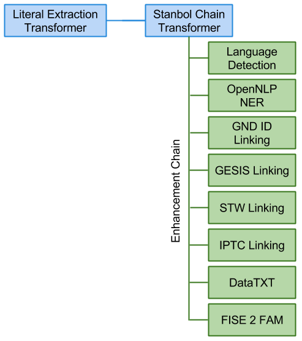

#Large-scale Technical Validation of Fusepool P3 Platform 
###Deliverable D5.4


[TOC]

----------

#### Document History ####

| Ver. | Name | Date | Remark |
| :---: | :--- | :---: | :--- |
| v0.0 | Carl Blakeley, Milos Jovanovik | 08.06.2015 | Initial draft |
| v0.1 | Milos Jovanovik, Carl Blakeley, Adrian Gschwend, Reto Gmür, Rupert Westenthaler | 15.06.2015 | Pre-review version |
| v0.2 | Milos Jovanovik, Carl Blakeley, Adrian Gschwend, Reto Gmür, Rupert Westenthaler | 22.06.2015 | Reviewed version |
| v0.3 | Milos Jovanovik, Carl Blakeley, Adrian Gschwend, Reto Gmür, Rupert Westenthaler | 29.06.2015 | Reviewed version |

#### Document Information ####

- Deliverable Nr Title: D5.4 Large-scale technical validation of Fusepool P3 platform
- Lead: Milos Jovanovik (OGL)
- Authors: Milos Jovanovik, Carl Blakeley (OGL), Adrian Gschwend (BUAS), Reto Gmür (BUAS), Rupert Westenthaler (SRFG)
- Publication Level: Public

#### Document Context Information ####

 - Project (Title/Number): Fusepool P3 (609696)
 - Work Package / Task: WP5 / T5.6
 - Responsible person and project partner: Milos Jovanovik (OGL)

#### Quality Assurance / Review ####

- 1st reviewer: Jakob Frank (SRFG)
- 2nd reviewer: Luigi Selmi (BUAS)

#### Official Citation ####
Fusepool-P3-D5.4

#### Copyright ####

This document contains material, which is the copyright of certain Fusepool P3 consortium parties. This work is licensed under the Creative Commons Attribution 4.0 International License. To view a copy of this license, visit http://creativecommons.org/licenses/by/4.0/.

#### Acronyms and Abbreviations ####

| Acronym | Description |
| --- | :--- |
| DoW | Description of Work |
| DDC | Dewey Decimal Classification |
| ECC | Error correcting code |
| NER | Named entity recognition |
| NLP | Natural language processing |
| FP3 | Fusepool P3 |
| FAM | Fusepool Annotation Model |
| FST | Finite state transducer |
| GND | Gemeinsame Normdatei (Integrated Authority File) |
| LLC | Library of Congress Classification |
| POS | Part of speech |
| SSD | Solid-state drive |

## Executive Summary ##

This document details the work performed and planned as part of Deliverable D5.4 / Task 5.6 "Large-scale technical validation of the Fusepool P3 platform".

**Status, June 2015:** At the current time this is an **interim report** detailing our goals and approach to large scale technical validation of the FP3 Linked Data Platform. The validation work is currently on-going.  It is our intention to include the validation test results themselves in a revised version of this report once testing is complete. 

The large scale testing is based on a central use case, Library Keyword Clustering, in which the main processing steps are:

* Aggregation of book subject information from library catalogues, authority files and DBpedia
* Analysis of coocurrences of book subject concepts and keyword clustering
* Analysis of the words/terms used in conjunction with a subject identifier (word contexts) to find related entities using Named Entity Recognition (NER) and Named Entity Linking (NEL)

The aim is to demonstrate large scale aggregation and transformation of information distributed across various locations, through a unified rerunnable workflow provided by the FP3 platform and which requires no end-user intervention once configured. Automated Linked Data generation and publishing through FP3 would be a significant improvement on the currently cumbersome, labour intensive manual subject indexing by librarians.

The Library Keyword Clustering (LKC) use case centres on the interlinking of three large datasets:  two library catalogues, the [B3Kat](https://lod.b3kat.de/) catalogue and the [GND catalogue of the German National Library](http://www.dnb.de/EN/Standardisierung/GND/gnd.html),  and [DBpedia](http://dbpedia.org). 

The seed dataset, B3Kat, contains approximately 26 million bibliographic records. The three core datasets combined total around 2 billion triples. We estimate that the resulting data corpus after enrichment will be approaching 3 billion triples.

## Introduction ##

The DoW {TO DO: Link} for the Fusepool P3 project describes the main task of this deliverable as: 

*"T5.6 Technical validation of Fusepool Linked Data Platform: implementation will be tested through the large-scale real life use cases defined in WP1 to ensure that an industry-strength Linked Data platform is created...".*

In selecting use cases for large scale testing, our choice was influenced by two criteria: 

 - the test data should be sufficiently large to adequately test the ability of the FP3 platform to handle large data volumes;
 - processing of the test data should exercise as much of the platform as possible.

The use cases driving the development of the FP3 Platform have been defined as part of WP1 and are described in the Deliverable 1.1 report ["D1.1 Use cases and data specified, data modelled and prepared"](https://github.com/fusepoolP3/p3-wp1-deliverables/blob/master/d11-deliverable.md). From these, we selected one use case to form the basis of the large scale testing of the platform:

[Large Scale Validation Use Case: Library Keyword Clustering](https://github.com/fusepoolP3/p3-wp1-deliverables/blob/master/d11-deliverable.md#large-scale-validation-use-case-library-keyword-clustering)

This use case focuses on exercising the bulk import and bulk transformation features of the platform, along with the ability to handle large datasets.

## Library Keyword Clustering (LKC) 

The "Linked Keyword Clustering" (LKC) use case is described in detail in the WP1 [Deliverable 1.1 report](https://github.com/fusepoolP3/p3-wp1-deliverables/blob/master/d11-deliverable.md#large-scale-validation-use-case-library-keyword-clustering)]. For convenience, we provide an overview below.

### Key Datasets
The LKC use case centres on the interlinking of three large RDF datasets:  two library catalogues - the [GND catalogue of the German National Library](http://www.dnb.de/EN/Standardisierung/GND/gnd.html) and the [B3Kat](https://lod.b3kat.de/) catalogue - and [DBpedia](http://dbpedia.org).

####GND Dataset

An [Integrated Authority File](http://en.wikipedia.org/wiki/Integrated_Authority_File) (German: Gemeinsame Normdatei) or GND is an international authority file for the organisation of personal names, subject headings and corporate bodies from catalogues. It is used mainly for documentation in libraries and increasingly also by archives and museums. GNDs is managed by the German National Library (Deutsche National Bibliothek) in cooperation with various library networks in German-speaking Europe and other partners.

The [Linked Data Service of the German National Library](http://www.dnb.de/EN/Service/DigitaleDienste/LinkedData/linkeddata_node.html) has made their entire [GND catalogue available as Linked Data dumps](http://datendienst.dnb.de/cgi-bin/mabit.pl?userID=opendata&pass=opendata&cmd=login). The [GND RDF data dump](http://datendienst.dnb.de/cgi-bin/mabit.pl?userID=opendata&pass=opendata&cmd=login) is roughly 0.8GB, comprising approximately 10,900,000 records.

{TO DO}: Add some more information about the Data contained in this Dataset

####B3Kat Dataset
[B3Kat](http://www.b3kat.de/) is the "common union catalogue" of [BVB](http://www.bib-bvb.de/) (Bavarian Library Network) and [KOBV](http://www.kobv.de/) (Cooperative Library Network Berlin-Brandenburg). The [B3Kat Linked Open Data Service](https://lod.b3kat.de/) provides an RDF catalogue of 180 academic libraries in Bavaria, Berlin and Brandenburg, describing roughly 26 million titles. 

The [B3Kat RDF data dump](https://lod.b3kat.de/download) contains about 890 million RDF triples in 7.7GB of data.

{TO DO}: Add some more information about the Data contained in this Dataset

####DBpedia Dataset
The [DBpedia](http://dbpedia.org) dataset describes 4.58 million entities, including 1,445,000 persons, 735,000 places, and 241,000 organizations. The data set features labels and abstracts for these entities in up to 125 different languages; 25.2 million links to images and 29.8 million links to external web pages. It consists of 3 billion RDF triples, out of which 580 million were extracted from the English edition of Wikipedia, 2.46 billion were extracted from other language editions. DBpedia is connected with other Linked Datasets by around 50 million RDF links. [DBpedia dumps](http://wiki.dbpedia.org/Downloads) in 119 languages are available on the DBpedia download server.

{TO DO}: Are these numbers correct? 3 billion DBpedia alone? There is another number later in this document when we calculate the total amount of triples.


### Initial Dataset Connections

At the outset, before any interlinking by the FP3 framework, minimal connections existed between the source datasets. These minimal base connections, which provided the initial basis for richer interlinking and enrichment, are outlined below.

#### B3Kat - GND
The B3Kat dataset links to the GND corpus through GND IDs held as `dcterms:subject` values. 

The home page of the [B3Kat Linked Open Data Service](https://lod.b3kat.de/) includes a link for displaying an [example title](https://lod.b3kat.de/example). From this, it can be seen that the `dcterms:subject` property contains a number of subject identifiers, using several classification schemes include [GND](http://www.dnb.de/EN/Standardisierung/GND/gnd.html), [DDC](http://en.wikipedia.org/wiki/Dewey_Decimal_Classification) and [RVK](https://www.uni-erfurt.de/en/bibliothek/library-erfurt/research/classification-rvk/). The LKC use case makes reference to Hanns Eisler's "Deutsche Sinfonie" <https://lod.b3kat.de/page/title/BV001289953> as a central example - again the `dcterms:subject` property uses subject identifiers spanning the GND, DDC, [LLC](http://en.wikipedia.org/wiki/Library_of_Congress_Classification) and RVK schemes.

#### GND - DBpedia

The GND dataset includes links to DBpedia resource descriptions for many items, through `owl:sameAs` properties. For example, the GND entry for Hans Eisler includes:

    <rdf:Description rdf:about="http://d-nb.info/gnd/118529692">
        <rdf:type 
        rdf:resource="http://d-nb.info/standards/elementset/gnd#DifferentiatedPerson" />
        <foaf:page       rdf:resource="http://de.wikipedia.org/wiki/Hanns_Eisler" />
        <owl:sameAs rdf:resource="http://dbpedia.org/resource/Hanns_Eisler" />
        ...
        <gndo:surname>Eisler</gndo:surname>
        ...
    </rdf:Description>

###Primary Use Case Goals

Beyond providing a basis for large scale testing of the FP3 platform, the main goals from the user's perspective of this application of the platform are: 

 - make GNDs more usable;
 - aggregate information about concepts identified by GNDs and enrich them with NER and dictionary matching;
 - add context around a GND concept, identifying related concepts;
 - for each document in the B3Kat catalogue,  use the GND IDs associated with the document to identify the main subject concepts of the document;
 - identify related documents connected to the same subject(s);
 -  create a tag cloud of co-occurring entities (places, persons, organizations ...) for each subject concept;
   - e.g. Which places are mentioned in the title text of books about Hanns Eisler? How often do they occur?

### Broad Approach

- Load the GND, B3Cat and DBpedia datasets into quad storage, making them available for querying via SPARQL.
- Use CONSTRUCT queries to create initial graphs, one graph per GND.
- From these graphs, generate approximately 25 million files containing mash-ups of the source RDF data, which will then be posted to a transforming LDP container.
- Once in LDP, the linked transformer triggers entity extraction and NER on book titles.
 
{TO DO}: To Technical for an Overview (e.g. use CONSTRUCT queries) ... focus on the description of the necessary steps. e.g. Import the RDF, Preprocess the RDF according to the use-case requirements. Enrich the RDF using the Fusepool Platform. Host the enriched Data using the Fusepool Platform (SPARQL and LDP).

## Test Infrastructure

### Estimated Dataset Sizes

The source datasets total approximately 2 billion triples:

| Source dataset | Approximate size |
| :-- | :-- |
| GND | 124 million triples |
| B3Cat | 890 million triples |
| Dbpedia | 1 billion triples (assuming the full dataset and associated ontologies are loaded) |

{TO DO}: These numbers do not correspond to the numbers above in the overview. Either we need to say that we use a subset of them or we correct it accordingly.

We estimate the resultant transformed aggregated data will comprise under 1 billion triples - a Turtle mockup of the desired output by the end users suggests that there will be ~200 triples per subject. Assuming the source data covers approximately 3 million authors, the output data will be of the order of 600 million triples held in LDP storage.

The estimated total data corpus size of 3 billion triples, together with past experience of the core software components to be exercised, was then used as the basis for specifying the test platform hardware.

###Software

#### FP3 Platform Deployment

For ease of deployment, the FP3 test platform will be composed from Docker images.

 -   [FP3 Platform reference implementation - Docker image details]( https://github.com/fusepoolP3/p3-platform-reference-implementation)
 - [VOS - Docker image details](https://github.com/fusepoolP3/virtuoso-docker)
 
#### Storage Layer

Although Marmotta has provided the RDF storage for much of the FP3 development, Virtuoso Open Source Edition (VOS) was chosen as the storage layer, to provide the quad store, LDP server and SPARQL endpoints. A number of evaluations have tested Virtuoso and found it to be scalable to the region of 1 billion+ triples. Virtuoso Commercial Edition was not considered necessary for the calculated use case dataset sizes. VOS supports multiple cores, so a single server instance running on a single machine is suitable. The GND, B3Cat and DBpedia datasets will be loaded directly into the Virtuoso quad store.

{TO DO}: 1 billion+ sounds not right? In terms of this should be higher or not?
 
### Hardware

The test platform comprises a dedicated server, not a virtual machine, with the following specification:

 - 2 x Intel Xeon E5 2620V2, 2 x (6 x 2.10 GHz)
 - 128 GB buffered ECC RAM
 - 1000 GB SSD (Samsung 840 EVO)
 - Ubuntu 15.04

####Memory Requirements

Based on the anticipated size of the datasets and generated data, we estimated the amount of RAM required to be roughly as follows:

 - Virtuoso 7 typically requires 10GB per billion triples (10 bytes per quad), depending on how well the particular datasets compress for storage. 32GB RAM for Virtuoso was considered sufficient for ~3 billion triples. In general, memory is more important than disk storage, as once the database is 'warm', i.e. the database working set is in memory, then disk access is minimized.
 - Stanbol's memory requirements were estimated to be ~4GB. For creating Solr indexes with the Entityhub Indexing Tool, Jena TDB will be used as the source for indexing. Jena TDB is not required at runtime. The entity labels are held in memory, encoded in a FST (~300MB for all DBpedia's English labels).
 - Other Fusepool Transformers memory requirements are limited to in-memory caching of currently processed items. Their memory requirement will be far below 1GB.

##Data Transformation
### Source Dataset Loading

A prerequisite for transforming all this data was that the source datasets be loaded into the test LDP server. Virtuoso incorporates a bulk loader for importing large RDF datasets.  Although B3Kat and DBpedia provide public SPARQL endpoints (the German National Library does not make a SPARQL endpoint for GND catalogue), it was not thought feasible (or responsible) to rely on these endpoints for such large scale processing.

{TO DO}: Outline the number of expected requests.

### Use Case Task Details

The use case description provided by the WP1 Deliverable 1.1 report lists the main processing steps necessary to provide the desired enrichment and interlinking. These are re-iterated again below, but with a focus on the technical details of realizing the data transformations.

Some of the use case tasks, primarily preparation of the input data in tasks 1 - 5, are to be performed by the application stakeholders (primarily Johannes Hercher, Free University Berlin). Tasks 6 - 8 will be performed by the FP3 platform itself and constitute the core of the validation testing.
 
####1: Make a graph per GND subject for each B3Kat record

Approximately half of B3Kat's 26 million bibliographic records about books include links to between 1 and 10 related GND subject identifiers. 

See for example Hanns Eisler’s Deutsche Sinfonie https://lod.b3kat.de/page/title/BV001289953. Using the [B3Kat SPARQL endpoint](https://lod.b3kat.de/doc/de/sparql-endpoint/):

     SELECT * WHERE { 
       <http://lod.b3kat.de/title/BV001289953> 
         dc:title ?title ;
         dct:subject ?subject 
         filter regex(str(?subject), "d-nb.info/gnd")
     }
    
returns
    
| title | subject |
| :-- | :-- |
| Hanns Eislers "Deutsche Sinfonie" | http://d-nb.info/gnd/118529692 |
| Hanns Eislers "Deutsche Sinfonie" | http://d-nb.info/gnd/4222905-4  |

For each GND ID listed as a `dct:subject` in a B3Kat record, a graph will be created by a CONSTRUCT query, using the GND ID as the graph URI.

####2: Get basic information about each GND subject

B3Kat contains only GND IDs and no additional information from the GND authority file is available. However, this information is available in the GND RDF dumps. For instance, alternative labels, geo information, semantic relations (broader, narrower, related), subject categories, mappings to Wikipedia and DBpedia. (See also Appendix A for an example of a typical entry from the GND dataset.)

Each graph created in step 1 will be augmented with information about the subject concept extracted from the subject description in the GND dataset.

####3: Get additional GND subject data from DBpedia

Many GND concepts have a link to DBpedia.  See Appendix A for an example;  the description of Eisler includes:

    <owl:sameAs rdf:resource="http://dbpedia.org/resource/Hanns_Eisler" /> 

This link will be used to fetch additional data, such as: `foaf:depiction`, `dbpedia-owl:thumbnail`, `dc:description`, `rdfs:comment`, `dbpedia-owl:abstract`, `dcterms:subject`, etc., to augment each base graph of step 1.

####4: Get co-occurring concepts from B3Kat

For a given B3Kat concept, we can get details of other B3Kat concepts which are co-occurring with it. For example, using the [B3Kat SPARQL endpoint](https://lod.b3kat.de/doc/de/sparql-endpoint/), we can find documents which reference concept Hanns Eisler in some way:

    SELECT distinct ?s ?p WHERE { 
     ?s ?p <http://d-nb.info/gnd/118529692>; # - Hanns Eisler
    } ORDER BY ?s LIMIT 500
returns:

| s | p |
| :-- | :-- |
| <http://lod.b3kat.de/title/BV000153283> | <http://id.loc.gov/vocabulary/relators/aut> |
| <http://lod.b3kat.de/title/BV000153283> |<http://purl.org/dc/terms/creator> |
| <http://lod.b3kat.de/title/BV000154417> | <http://purl.org/dc/terms/subject> |
| <http://lod.b3kat.de/title/BV000192526> | <http://id.loc.gov/vocabulary/relators/aut> |

The `dct:subject`s of the returned B3Kat documents provide co-occurring GND concepts.

####5: Get texts from other B3Kat documents referencing the concept

For a given GND concept, we search for other documents which reference the concept in some way and extract their title and subtitle as the basis for NER.

e.g. Find the title and subtitle of documents which reference Hanns Eisler:

    PREFIX isbd: <http://iflastandards.info/ns/isbd/elements>

    SELECT DISTINCT ?s ?title ?subtitle
     WHERE { 
      ?s ?p <http://d-nb.info/gnd/118529692> ; # - Hanns Eisler 
     dc:title ?title ;
     optional { ?s isbd:P1006 ?subtitle }
    } LIMIT 500
    
####6: Perform NER on selected document texts

At this point, the graphs created and populated by steps 1 - 5 provide the base context for enrichment and interlinking by the FP3 platform. By some ETL process external to the platform and orchestrated by the end-user, each graph (1 per GND concept) will be used to generate an RDF document (of somewhere between 100 - 1000 triples) which will be deposited in a common transforming LDPC **[ISSUE]**. The transforming LDPC will be linked to an FP3 pipeline transformer combining the required transformers.

For each RDF document, we use the contained titles of books related to the core concept, and the DBpedia abstract for the core concept, as the input for NER analysis.

**ISSUE:** The Transforming LDPC Proxy in its current form takes a non-RDF resource and transforms it to RDF. This use case requires the Transforming Proxy to take an RDF resource as input.

 - What proxy modifications are required?
 - How will the input RDF resource be distinguished from the output RDF resource?

#####NER for LKC - Implementation

Stanbol supports a number of NLP/NER frameworks including Stanford NLP and OpenNLP. For this use case, OpenNLP will be used as it provides a basic NER model that can detect Persons, Organizations and Locations in German language texts. While there is also a German model for Stanford NLP this is only available for an older software version that is not compatible with the Stanford/Stanbol integration. As their are also English books to be processed OpenNLP will be configured with both German and English language models.

In common with most of the other Stanbol enhancement engines, OpenNLP accepts plain text. The [Literal Extraction Transformer]( https://github.com/fusepoolP3/p3-literal-extraction-transformer) will provide the plain text input to OpenNLP, by combining the Literal Extraction and Stanbol transformers in a pipeline. The Literal Extraction Transformer can be configured to iterate over specific literal predicates in particular languages, concatenating the text for the same language and emitting plain text.

#####NER for LKC - Expectations

Public available NER models typically include support for Persons, Organizations and Places and are trained based on news text corpora. In-domain (meaning when applied to news texts other than the training set) those systems typically reach F1 measures above 90%. However when applied to other type of texts the performance can drop drastically.

Expected input texts for the LKC domain will be very different from news texts. Texts are essentially concatenated titles and sub titles. Meaning that the texts will not contain full sentences nor will sentences be connected to previous sentences.

Because of that we expect available NER models to perform very badly on the data of this use case. Nevertheless, in spite of reservations about the quality of expected NER results,  we believe the use case is fit for purpose for validating that the platform can handle large amounts of data.

To obtain better results, it would be necessary to train specific NER models based on a training set on the LKC texts. Experience on other datasets suggests that one can train a reasonable good model with about 3000 manually annotated entities per entity type. We consider training an LKC-specific model to be outside the scope of this validation task.

Extracted Named Entities will be represented in the results by using the [Entity Mention Annotation](https://github.com/fusepoolP3/overall-architecture/blob/master/wp3/fp-anno-model/fp-anno-model.md#entity-mention-annotation) as defined by the Fusepool Annotation Model (FAM). The [Literal Extraction Transformer]( https://github.com/fusepoolP3/p3-literal-extraction-transformer) consumes those annotations and converts them to explicit triples to be added to the enriched LKC dataset.

####7: Match thesauri concepts to each GND

In this step, we will perform *entity linking* against each GND ID with the aim to detect mentions of GND IDs in the titles and sub-titles of the LKC data. Mentioned GND Ids will be represented in the results by using [Entity Annotation](https://github.com/fusepoolP3/overall-architecture/blob/master/wp3/fp-anno-model/fp-anno-model.md#entity-annotation) as defined by the Fusepool Annotation Model (FAM).

NOTE: this is different from the *Named Entity Recognition* in step 6. *NER* detects types of Entities in the text without the need of any controlled vocabulary. This means that NER can detect new/unknown entities. *Entity linking* works based on a controlled vocabulary - in that case the GND. It uses the names (preferred and alternate) as input and looks for mentions of those in the text. If it finds such a mention is links the according entity with that mention in the text.

The Fusepool platform provides several entity linking implementations. Options include:
 
 * Dictionary Matching Transformer,
 * Stanbol Entityhub Linking Engine
 * Stanbol FST Linking Engine 

For this use case we will use the [FST Linking egine](http://stanbol.apache.org/docs/trunk/components/enhancer/engines/lucenefstlinking) of Apache Stanbol as this one is most efficient for linking against vocabularies with the size of the GND. The index required by the FST Linking Engine will be build in a pre-processing step by using the RDF indexing tool provided by Apache Stanbol.

As with step 6, the Literal Extraction Transformer will be used to collect and concatenate the input text from literals of processed Entities. The Literal Extraction Transformer will also be used to consume the extraction results represented by the Fusepool Annotation Model (FAM) and convert them to explicit triples to be added to the enriched LKC data.

In addition to GND IDs Entity Linking will be also provided for the following three SKOS based thesauri:

 * The [Thesaurus for the Social Sciences](http://www.gesis.org/en/services/research/thesauri-und-klassifikationen/social-science-thesaurus/) ([The Soz](http://www.semantic-web-journal.net/sites/default/files/swj279_2.pdf)).
 * The [IPTC](https://iptc.org/) media topics [thesaurus](https://iptc.org/standards/media-topics/), a 1100-term taxonomy with a focus on categorizing text. The Media Topics vocabulary can be viewed on the [IPTC Controlled Vocabulary server]( http://cv.iptc.org/newscodes/mediatopic).
 * The [STW Thesaurus for Economics](http://zbw.eu/stw/versions/latest/download/about.en.html).

The Thesaurus for the Social Sciences (theSoz) is curated by [GESIS](http://www.gesis.org/en/institute/), the largest infrastructure institution for the Social Sciences in Germany (Leibniz Institute for Social Sciences)[1]. GESIS reviews and describes a vast amount of publications from major journals in the Social Sciences, in order to make research retrievable at a central hub. TheSoz is used to describe the contents of scientific efforts with a controlled language (Thesaurus). The list of keywords contains about 12,000 entries, of which more than 8,000 are descriptors (authorised keywords) and about 4,000 non-descriptors (synonyms). All major topics in the social science disciplines are included in three european languages (german, french, english).
 

####8: Matching against DBpedia

Some entities are not covered by the GND, or the subject terminologies. In order to find additional related concepts in DBpedia and related Wiki pages in Wikipedia, we propose trying to find them using alternative entity linking services. Two candidate services are [dataTXT](http://dandelion.eu/datatxt/) and [DBpedia Spotlight](https://github.com/dbpedia-spotlight/dbpedia-spotlight/wiki). Both are available as Stanbol enhancement engines, accessible through the FP3 Stanbol Enhancer Transformer.

dataTXT is a named entity extraction & linking service that, given a plain text, gives back a set of entities found in the text and links to corresponding entries in Wikipedia. It also optionally returns the entity type from DBpedia. 

dataTXT performs very well even on short texts, on which many other similar services do not. It is based on co-references of entities, it does not use any NLP feature. Even if the input texts are not complete sentences, we expect it to return valid results. For this reason it is our preferred service for this step.

DBpedia Spotlight provides a fallback option. However, we feel it is unlikely to produce better results than dataTXT. Should we opt to try this option, we will configure our own DBpedia Spotlight service.

**TO DO:** More technical details of this processing step required

[Q->Adrian] Re: the use case example for step 8: "Cantata on the death of a comrade for singing..."

- Where is this text from?
- What is the B3Kat URI of this entity?
- Does this entity not have a corresponding GND ID?

##Data Consumption

The large scale validation should include examples of consuming the enriched/interlinked data. For this project, we believe it is sufficient to provide example SPARQL queries illustrating how the Linked Data might be consumed, or at most create a simple user interface.

TO DO: Sample SPARQL queries.

##Validation Metrics

TO DO

### System/Disk

* I think we should monitor disk IO & memory usage during the run so we can see what we used. Need to see what's state of the art on Linux as of now

### Network/HTTP
* To properly analyse performance we need to know how our HTTP requests to transformer & pipeline are doing
* Capturing it in the proxy itself will not catch individual transformers in pipeline
* To do that we either have to log in each transformer itself and analyse it later or we grab what's going on on the network with pcap (tcpdump)
* There is a [spec](http://www.softwareishard.com/blog/har-12-spec/) from Google to analyse such data, it's called [HAR](https://www.igvita.com/2012/08/28/web-performance-power-tool-http-archive-har/), export for this is built in in Chrome for example
* There seems to be ways to generate that out of `pcap` files, for example [pcap2har](https://github.com/andrewf/pcap2har)
* There are tools with frontends, for example [harviewer](https://code.google.com/p/harviewer/) or [PCAP Web Performance Analyzer](https://pcapperf.appspot.com/)
* We would need to see if we get the information we need (probably mainly response time)
* We would have to script something on our own to analyse the results
* I'm not sure about the code, the repositories look pretty much unmaintained so no clue if the code still works (seems mainly Python)
* [YSlow](http://yslow.org/node-server/) is an analyser written in Node.js which might be a good (and maintained) option

## Validation Results

During LKC Use Case the fp3 platform was used to:

 A) Compute coocurrence links (closeness of use) between GND-ids based on their use within > xxx mill records of B3Kat. 
 B) Enrich bibliographic records (B3Kat) with links to thesauri (STW, Thesoz, IPTC, Agrovoc), and DBpedia.
 C) Extract Named Entities from bibliographic records, and descriptions about the authority files' concepts (GNDid). 
 
In this section we assess the fp3 platform based on the mentioned task from a stakeholders point of view. 
The evaluation is done both quanitative (count of links, count of correct links), and qualitative (manual assesment of usefulness). 
 

### (A) Evaluation of GND Coocurrence Enrichment

In the selected use case for large scale technical validation, an important part played by the FP3 Platform is the creation of co-occurrence relations, as described in Section 4. These links are dedicated to support librarians and patrons with novel recommendation features. 
Two GNDs are considered as co-occurrent if they are used together within a B3Kat record, to describe a bibliographic resource. Based on the frequency of their joint use one can compute the distance of two GND ids (cf. Details in Sect 4).
In total 2.000.0000 {?} GND ids were processed, based on their coocurrence within >20.000.000 bibliographic records from B3Kat.

Different types of GND-ids were selected with the following sparql to get an impression for wich types the generation of coocurence relations performs well.

```
	prefix gnd: <http://d-nb.info/standards/elementset/gnd#>

	SELECT distinct ?G ?gnd
	 WHERE 
	 {
   	  GRAPH ?G {
      			?gnd <http://dbpedia.org/ontology/abstract> ?abstract ;
           		a gnd:DifferentiatedPerson .
         		# a gnd:ConferenceOrEvent .
         		# a gnd:CorporateBody .
         		# a gnd:PlaceOrGeographicName .
         		# a gnd:SubjectHeading .
         		# a gnd:HistoricSingleEventOrEra .
         		# a gnd:Work .
   	    		}
   	FILTER regex(?G, 'ttl-transformed$')
	}
	ORDER BY ?G
	LIMIT 100

```
70 GND-IDs were hand picked to examine their count of coocurrence (cf. [A_GNDs-by-type.txt](evaluation-files/A_GNDs-by-type.txt)).
Each GND-ID was examined with the following sparql (cf. [A_examine-gnd-sparql.rq](evaluation-files/A_examine-gnd-sparql.rq)


```

	# find coocurrent GND's for GND http://d-nb.info/gnd/100001718 located in GRAPH <http://ulcs.fusepool.info:8181/DAV/home/fusepool/ldp/FU_Berlin_Extraction_Pipeline_Container/Data/201-300.ttl-transformed> 

	define input:inference "gnd-labels"

	prefix skos: <http://www.w3.org/2004/02/skos/core#>  
	prefix skoso: <http://www.w3.org/2008/05/skos#> 
    prefix x: <http://example.org/x/>  
    
	SELECT distinct ?linkedEntity ?label ?distance  

	WHERE 
	{
   		GRAPH <http://ulcs.fusepool.info:8181/DAV/home/fusepool/ldp/FU_Berlin_Extraction_Pipeline_Container/Data/201-300.ttl-transformed>
		{
   			<http://d-nb.info/gnd/100001718>  x:hasCooc ?c .  
   			?c x:uri ?linkedEntity ;  
       		   x:closeness ?distance . 
		}
    	OPTIONAL { GRAPH <http://d-nb.info-gnd/> {  ?linkedEntity skos:prefLabel ?label . }}  
    	OPTIONAL { GRAPH <http://d-nb.info-gnd/> {  ?linkedEntity skoso:prefLabel ?label . }}  
		
		FILTER regex(?linkedEntity, '/gnd/')
	}
	ORDER BY DESC (?distance) 
	
```

**Results**

Only 28 of the 70 randomly picked GNDs had a coocurrence relation to other GNDs. Please note that this does not reflect the performance of the platform, but the state of the data, and the feasibility of using contextual links.
Most coocurrence relations where available for persons (8 of 10) and SubjectHeadings (7 of 10), whereas CorporateBody, places and historic events appear to be used much less in joint with other GNDs.   
A manual assessment of the usefulness of the created links was considered but withdrawn, as some concepts had a maximum count of >100 coocurrent GNDs.

|				|  person | subject	 | conference 		 	| corporation	 | place			| hist. Event	 	|**sum**	|
|---			|---	  |---		 |---		 			|---			 | ---				| ---				| ---		|
|count assessed	| 	  8/10|		 7/10|		 			5/10|			 3/10| 			  2/10	|	   	3			|	   28/70| 
|avg cooc kw	| 	   7,8|		 93,1|		  			 4,4| 		     59,7|				19	| 		2			|		31	| 
|Max cooc kw	| 		17|		  422|					   7| 		 	   88| 				36	| 		2			|		422	| 
|Min cooc kw	| 		 2| 		4| 					   1|			  	3| 				2	| 		2			|		1	| 
|Median cooc kw	| 	   3,5| 		7| 					   4|			   44| 				19	| 		2			|		6	| 


(s. [Evaluation of gernerated coocurence relations, based on a set of 28 GND IDs](#a_gnd-cooc-analysis))

![Evaluation of gernerated coocurence relations, based on a set of 28 GND IDs][a_gnd-cooc-analysis]

[a_gnd-cooc-analysis]: evaluation-files/A_results-chart.png "Evaluation of gernerated coocurence relations, based on a set of 28 GND IDs" width="485px" height="255px"


## (B1) Interlinking: GND - B3Kat ##

Within the LKC the dictionary matching is used to find appropriate GND-IDs for texts in B3Kat's bibliographic data (records). 
The stakeholder wants to know if this processing is feasible to provide a more coherent dataset. 

In this part we evaluate the reliability of the platform to generate interlinkings to the GND Authority file. 
The goal is to assess if the dictionary matcher component (gnd-plain-linking) works as expected to link plain texts to the corresponding GND identifier.
As gold standard, we select a set of records that have already links to the GND Authority file (cf. sparql below), 
and compare the results with the already existing links. This method allows us to test if the platform can reliable reveal all links. 


The set of GND ids was selected via sparql :

```
    SELECt distinct ?s 
    FROM <http://lod.b3kat.de/>
    WHERE  { 
  	#select records from B3Kat in german language, and filter for those that have URI in dc:subject and text in dcterms:subject
 	 ?s <http://purl.org/dc/terms/language>  <http://id.loc.gov/vocabulary/iso639-2/ger> .
  	 ?s <http://purl.org/dc/elements/1.1/subject> ?text 
         ?s <http://purl.org/dc/terms/subject> ?subject
    }
    LIMIT 100
    Offset 1250


``` 

From the [processed set](http://ulcs.fusepool.info:8181/DAV/home/fusepool/ldp/Platform_StressTest/Corrected-Processing/B3Kat/B3Kat-Subject-GND-linking/)
we compute the overlap as follows:

```
Overlap (in %) = ( A / B ) * 100
where:
A: Count of keywords in `dcterms:subject` for one record in German language.
B: Count of correct matchings to GND-IDs for one record.

```

The result was assessed with the sparql query below, and they were also manually spot checked.

```
    # compute overlap of plain text keywords () of a record with its linked GND-id labels
	define input:inference "gnd-labels"

	prefix skos: <http://www.w3.org/2004/02/skos/core#>  
	prefix skoso: <http://www.w3.org/2008/05/skos#>  
	PREFIX isbd: <http://iflastandards.info/ns/isbd/elements/>  
	PREFIX dc: <http://purl.org/dc/elements/1.1/>  
	PREFIX fp3: <http://vocab.fusepool.info/fam#> 

	SELECT distinct ?s ?title ?subtitle count(?kw) AS ?kwCount count(SAMETERM(?kw, ?label)) AS ?correctMatch (xsd:float(?correctMatch)/xsd:float(?kwCount)*100 AS ?result)
	FROM <http://ulcs.fusepool.info:8181/DAV/home/fusepool/ldp/Platform_StressTest/Corrected-Processing/B3Kat/B3Kat-Subject-GND-linking/1-100.ttl-transformed>
	FROM <http://ulcs.fusepool.info:8181/DAV/home/fusepool/ldp/Platform_StressTest/Corrected-Processing/B3Kat/B3Kat-Subject-GND-linking/101-200.ttl-transformed>
	FROM <http://ulcs.fusepool.info:8181/DAV/home/fusepool/ldp/Platform_StressTest/Corrected-Processing/B3Kat/B3Kat-Subject-GND-linking/201-250.ttl-transformed>
		WHERE 
		{
   			?s dc:title ?title ;  
      		   dc:subject ?kw .
   		OPTIONAL {?s isbd:P1006 ?subtitle .}  
   		OPTIONAL {?s fp3:entity-reference ?linkedEntity .}        
   		OPTIONAL { GRAPH <http://d-nb.info-gnd/> { ?linkedEntity skos:prefLabel ?label . } } 
   		OPTIONAL { GRAPH <http://d-nb.info-gnd/> { ?linkedEntity skoso:prefLabel ?label . } } 
		}
		ORDER BY DESC(?s) 

```

**Results**
The platform outperformed the expectations (70-80%) by finding 100% of the pre-existing links of 250 records. 
Thererfore the platform may be very useful to generate GND ids in records that have yet only plain text (but controlled) keywords.


### (B2) Interlinkings to controlled terminologies from B3Kat titles + keywords 

The goal here is to find out if the plattform can generate useful links to controlled terminologies, such as IPTC, Agrovoc, Thesoz, STW, and DBpedia entities, based on the bibliographic data of a b3kat record.
This run used the [fuberlin-extraction chain](http://ulcs.fusepool.info:8304/enhancer/chain/fuberlin-extraction), which was configured to analyze [B3Kat records'](http://ulcs.fusepool.info:8181/DAV/home/fusepool/ldp/Platform_StressTest/B3Kat-Extraction/)
titles (`dc:title`), and subtitles (`isbd:P006`).
  
To assess the usefulness of generated contextual links to subject terminologies and DBpedia we assessed [26 records](evaluation-files/B2_dataset_1-100.csv)
manually, that were randomly composed via [sparql query](http://seminant.com/queries/5665792373656d0638931900):

```

 	# random records from B3Kat in german language, without URI in dc:subject
	
	select distinct ?s 
	FROM <http://lod.b3kat.de/>
	WHERE  { 
	  ?s <http://purl.org/dc/terms/language>  <http://id.loc.gov/vocabulary/iso639-2/ger> .
	  ?s <http://purl.org/dc/elements/1.1/subject> ?text 
	     MINUS{
	       ?s <http://purl.org/dc/terms/subject> ?o .
	     }
		}
	LIMIT 150
	Offset 1250

```

[26 records](evaluation-files/B2_dataset_1-100.csv) were assessed manually in regards of their usefulness. In other words: All misleading links that are clearly not related to the record were deemed as not useful.
This method was choosen because it is not reasonable to determine a fixed area of legitimate interest (Gold Standard) for the evaluation of exploratory search benefits.
Therefore the usefulness / success rate was computed as follows

```
( A / B ) * 100

A) are all links created by the platform that are somehow contextual related are "valuable" or correct suggestion (true)
B) are all evidently misleading links, i.e. incorrect suggestions (false)

```

This method allows us to measure the interlinking success, defy the odds of an missing disambiguation component, nonetheless it is based on a subjective human decision, that traceable in the [corresponding materials](evaluation-files/B2_eval_1-100.ods).

**Results** 

For the 26 assessed records the platform assigned 225 unique links to subject terminologies. 
47 of them were deemed as irrelevant, resulting in a usefulness of 77% (average) or 83% (median).
At least one uniqe link per record was created by the platform up to a maximum of 25 uniqe links per record.


|			|  records 	    | uniqe kw  | irrelevant kw  	| useful kw | usefulness|
|---		|---			|---		|---				|---		|---		|
| avg  		|  - 			|  8,7 		| 1,8  				| 6,8  		|	 	77% |
| min  		|  - 			|  1 		| 0  				| 0  		| 		 0% |
| max  		|  - 			|  25		| 9 				| 24  		| 	   100% |
| median  	|-   			|  6 		| 1  				| 5  		| 	**83%**	|
| sum  		| 26  			|  225 		| 47   				| 178  		| 		-	|


The results diverge very much [cf. chart below](#b2_results_chart), but show that the platform is capable to suggest a valuable amount of useful links to other subject terminologies.

![...][b2_results_chart]

[b2_results_chart]: evaluation-files/B2_results_chart-1.png "..." width="882px" height="468px"


Furture analysis could be done to determine why the interlinking performs so good or so bad, in some cases.

### (C) Extract Named Entities from bibliographic records
Please note that evaluation of NER extraction (C) is currently not done!!!  
@milos: maybe we can provide some quantitative statistics here? How many GNDs (%) are processed enriched with a fp3:named-entity-reference, how many in average per gnd? min/max median?  

otherwise we can delete this section.

## Conclusions and Future Work ##

TO DO

Should describe that this is work in progress and this document will be updated within the next months.

## References ##

TO DO

## Appendix A - GND RDF Description of Hanns Eisler

Below is the description of Hanns Eisler extracted from the GND dataset, illustrating a typical GND RDF description.

    <rdf:Description rdf:about="http://d-nb.info/gnd/118529692">
        <rdf:type rdf:resource="http://d-nb.info/standards/elementset/gnd#DifferentiatedPerson" />
        <foaf:page rdf:resource="http://de.wikipedia.org/wiki/Hanns_Eisler" />
        <owl:sameAs rdf:resource="http://dbpedia.org/resource/Hanns_Eisler" />
        <owl:sameAs rdf:resource="http://viaf.org/viaf/19865132" />
        <gndo:gndIdentifier>118529692</gndo:gndIdentifier>
        <gndo:oldAuthorityNumber>(DE-588a)118529692</gndo:oldAuthorityNumber>
        <gndo:oldAuthorityNumber>(DE-588a)185686249</gndo:oldAuthorityNumber>
        <gndo:oldAuthorityNumber>(DE-588a)139523375</gndo:oldAuthorityNumber>
        <gndo:oldAuthorityNumber>(DE-588a)134366263</gndo:oldAuthorityNumber>
        <gndo:oldAuthorityNumber>(DE-101c)310056268</gndo:oldAuthorityNumber>
        <gndo:oldAuthorityNumber>(DE-588c)4014114-7</gndo:oldAuthorityNumber>
        <gndo:variantNameForThePerson>Eisler, ...</gndo:variantNameForThePerson>
        <gndo:variantNameEntityForThePerson rdf:parseType="Resource">
            <gndo:forename>...</gndo:forename>
            <gndo:surname>Eisler</gndo:surname>
        </gndo:variantNameEntityForThePerson>
        <gndo:variantNameForThePerson>Eissler, Hanns</gndo:variantNameForThePerson>
        <gndo:variantNameEntityForThePerson rdf:parseType="Resource">
            <gndo:forename>Hanns</gndo:forename>
            <gndo:surname>Eissler</gndo:surname>
        </gndo:variantNameEntityForThePerson>
        <gndo:variantNameForThePerson>Eisler, Hans</gndo:variantNameForThePerson>
        <gndo:variantNameEntityForThePerson rdf:parseType="Resource">
            <gndo:forename>Hans</gndo:forename>
            <gndo:surname>Eisler</gndo:surname>
        </gndo:variantNameEntityForThePerson>
        <gndo:variantNameForThePerson>Eisler, Johannes</gndo:variantNameForThePerson>
        <gndo:variantNameEntityForThePerson rdf:parseType="Resource">
            <gndo:forename>Johannes</gndo:forename>
            <gndo:surname>Eisler</gndo:surname>
        </gndo:variantNameEntityForThePerson>
        <gndo:preferredNameForThePerson>Eisler, Hanns</gndo:preferredNameForThePerson>
        <gndo:preferredNameEntityForThePerson rdf:parseType="Resource">
            <gndo:forename>Hanns</gndo:forename>
            <gndo:surname>Eisler</gndo:surname>
        </gndo:preferredNameEntityForThePerson>
        <gndo:familialRelationship rdf:resource="http://d-nb.info/gnd/116435410" />
        <gndo:familialRelationship rdf:resource="http://d-nb.info/gnd/124362214" />
        <gndo:familialRelationship rdf:resource="http://d-nb.info/gnd/118691392" />
        <gndo:familialRelationship rdf:resource="http://d-nb.info/gnd/118681850" />
        <gndo:familialRelationship rdf:resource="http://d-nb.info/gnd/1054173877" />
        <gndo:professionOrOccupation rdf:resource="http://d-nb.info/gnd/4032009-1" />
        <gndo:professionOrOccupation rdf:resource="http://d-nb.info/gnd/4040841-3" />
        <gndo:playedInstrument rdf:resource="http://d-nb.info/gnd/4030982-4" />
        <gndo:playedInstrument rdf:resource="http://d-nb.info/gnd/4057587-1" />
        <gndo:gndSubjectCategory rdf:resource="http://d-nb.info/standards/vocab/gnd/gnd-sc#14.4p" />
        <gndo:geographicAreaCode rdf:resource="http://d-nb.info/standards/vocab/gnd/geographic-area-code#XA-DE" />
        <gndo:geographicAreaCode rdf:resource="http://d-nb.info/standards/vocab/gnd/geographic-area-code#XD-US" />
        <gndo:geographicAreaCode rdf:resource="http://d-nb.info/standards/vocab/gnd/geographic-area-code#XA-AT" />
        <gndo:placeOfBirth rdf:resource="http://d-nb.info/gnd/4035206-7" />
        <gndo:placeOfDeath rdf:resource="http://d-nb.info/gnd/4005728-8" />
        <gndo:placeOfActivity rdf:resource="http://d-nb.info/gnd/4042011-5" />
        <gndo:placeOfExile rdf:resource="http://d-nb.info/gnd/4078704-7" />
        <owl:sameAs rdf:resource="http://www.filmportal.de/person/18AC4FE0900B4565A8D821ED5F6A175E" />
        <gndo:gender rdf:resource="http://d-nb.info/standards/vocab/gnd/Gender#male" />
        <gndo:dateOfBirth rdf:datatype="http://www.w3.org/2001/XMLSchema#date">1898-07-06</gndo:dateOfBirth>
        <gndo:dateOfDeath rdf:datatype="http://www.w3.org/2001/XMLSchema#date">1962-09-06</gndo:dateOfDeath>
    </rdf:Description>

## Appendix B - Overview Notes on Apache Stanbol

This appendix provides a brief overview of the main components of Apache Stanbol relevant to the LKC use case, with the aim of supplying some background context to the technical points raised in the main document, for readers unfamiliar with Stanbol.

### Information Extraction for the LKC use case

For the LKC use case the following information extraction workflow is expected



The [Literal Extraction Transformer](https://github.com/fusepoolP3/p3-literal-extraction-transformer) is used to collect literals of the source RDF data to be used for information extraction. It also processes the information extraction results encoded using the [Fusepool Annotation Model](https://github.com/fusepoolP3/overall-architecture/blob/master/wp3/fp-anno-model/fp-anno-model.md) (FAM) and converts them to simple statements for the enriched RDF data.

The Literal Extraction Transformer is configured with a second transformer doing the actual information extraction work. As for the LKC use case Apache Stanbol is used for the information extraction work the [Stanbol Enhancer Transformer](https://github.com/fusepoolP3/p3-stanbol-enhancer-adapter/tree/master/service) is configured. This "transformer adapter" for the Apache Stanbol Enhancer allows to use Stanbol Enhancement Chains or single Enhancement Engines as Fusepool Transformers.

As the LKC use case requires several information extraction capabilities a Enhancement Chain supporting (1) Named Entity Linking , (2) Entity Linking against the GND, GESIS, STW and IPTC and (3) DBpedia linking by using the DataTXT engine is configured. As Stanbol uses the FISE annotation model also an engine that converts FISE into the Fusepool Annotation Model is required.

All the transformers and Stanbol components mentioned above are described in detail in D3.1: Section 9 provides details about the Fusepool Annotation Model; Section 10.1 gives details about the integration of Apache Stanbol to the Fusepool Plattform as Transformer. Section 10.2 provides details about the DataTXT integration.

The remainder of this appendix aims to provide a short overview on Apache Stanbol components used for the LKC use case.

### Enhancement Chain

An [Enhancement Chain](http://stanbol.apache.org/docs/trunk/components/enhancer/chains/) defines how content parsed to the Stanbol Enhancer is processed. More concretely it defines which [Enhancement Engines](http://stanbol.apache.org/docs/trunk/components/enhancer/engines) and in what order are used to process the parsed content. For the LKC use case an Enhancement chain with all the required Information Extraction Capabilities needs to be configured.

A typical Stanbol enhancement workflow is depicted below:


The typical information extraction workflow used with Apache Stanbol starts with a pre-processing step. In this step the parsed content is prepared for later information extraction. Plain Text extraction from rich text documents is a typical task performed in this step. For the LKC use case this step is not required as this work is already done by the [Literal Extraction Transformer](https://github.com/fusepoolP3/p3-literal-extraction-transformer) outside of Apache Stanbol.

The second step is about natural language processing. For the LKC this includes Language Detection and Named Entity Recognition. As OpenNLP requires Sentence Detection and Tokenization before NER those need also to be configured.

In the Semantic Lifting step the Entity Linking against the four controlled vocabularies and the dataTXT linking to DBPedia will take place.

In the post processing phase the FISE enhancements will be refactored to the Fusepool Annotation Model (FAM).

Apache Stanbol provides different Enhancement Chain implementations. Typically users want to use the [Weighted Chain](http://stanbol.apache.org/docs/trunk/components/enhancer/chains/weightedchain) as this supports automatic ordering of configured enhancement engines. So for the user it is sufficient to provide the list of required engines. The ordering is not of importance.

### Enhancement Engines

An Enhancement Engine is an information extraction component. It can extract plain text from a PDF file; detect the language of a text of a chapter; extract Named Entities like Persons or Placed, detect Mentions of Entities managed in a Controlled vocabulary; disambiguate results of previous engines or just refactor annotations to a different annotation model. 

Apache Stanbol comes with a wide range of Enhancement Engines and users can also implement and use customs one. For the LKC use case the following engines are required:

* Language Detection: The most common Language detection engine for Apache Stanbol is the [Langdetect Engine](http://stanbol.apache.org/docs/trunk/components/enhancer/engines/langdetectengine)
* Named Entity Recognition: For the use case [Apache OpenNLP](http://opennlp.apache.org/) will be used. For Named Entity Recognition the OpenNLP [Sentence Detection](http://stanbol.apache.org/docs/trunk/components/enhancer/engines/opennlpsentence), [Tokenizer](http://stanbol.apache.org/docs/trunk/components/enhancer/engines/opennlptokenizer) and [NER](http://stanbol.apache.org/docs/trunk/components/enhancer/engines/opennlpner) engines will get used.
* Entity Linking: As the texts for the LKC are not full sentences a linking engine that can link against all words in the text is best suited (PLAIN linking mode). For such a scenario the [FST Linking Engine](http://stanbol.apache.org/docs/trunk/components/enhancer/engines/lucenefstlinking) is best suited. It is based on The Apache Lucene FST (Finit State Transducer) API witch allows it to hold labels of large vocabularies fully in memory (e.g. for all English labels of DBPedia one needs less as 300MByte of memory). 
* DBPedia Linking: While the FST linking engine could also be used for DBPedia it does not provide support for disambiguation. Because of the we will use the [DataTXT engine](https://github.com/fusepoolP3/p3-datatxt-stanbol) instead. This engine is based on the [DataTXT](https://dandelion.eu/products/datatxt/) service.
* Fusepool Annotation Model support: Apache Stanbol uses the [Stanbol Enhancement Structure](http://stanbol.apache.org/docs/trunk/components/enhancer/enhancementstructure). When used as Fusepool Transformer those annotations need to be converted to the Fusepool Annotation Model. The [FAM engine](https://github.com/fusepoolP3/p3-stanbol-engine-fam) implements this conversion.

### Working with Custom Vocabularies

For using Entity Linking Engines it is required to create special indexes over custom vocabularies. For small and medium sized vocabularies those can be created while uploading them to Apache Stanbol. Hoever for big vocabularies or if one want to have more control on how those indexes are build Apache Stanbol provides a special batch processing tool for creating those.

The whole process is described by the [Working with Custom Vocabularies](https://stanbol.apache.org/docs/trunk/customvocabulary.html) usage scenario.

Here are the main Steps of the process:

* Build the Entityhub Indexing Tool and grab the binary `org.apache.stanbol.entityhub.indexing.genericrdf-*-jar-with-dependencies.jar`
* call the binary with the `init` command to initialise the configuration hierarchy
* edit the `indexing/conig/indexing.properties` file. See comments in this file for more information
* copy the RDF files of your controlled vocabulary to the `indexing/resources/rdfdata` folder
* call the binary with the `index` command to index the vocabulary
* after the indexing finishes the `indexing/dist` folder will contain two files
    1. `org.apache.stanbol.data.site.{name}-{version}.jar` an OSGI bundle to be installed to the Stanbol runtime. This Bundle provides the Entityhub configuration for the indexed dataset
    2. `{name}.solrindex.zip` an archived Solr core. This needs to be installed as data file to apache stanbol. The easiest way to do this is to copy it to the `stanbol/datafiles` folder of your stanbol instance.
    
After performing those steps you will have an Entityhub Site holding your Custom Vocabulary ready to be used with any of the Entity Linking Engines provided by Apache Stanbol. 

### Stanbol EntityHub

The [Entityhub](https://stanbol.apache.org/docs/trunk/components/entityhub) is the Stanbol component responsible for providing the information about entities relevant to the users domain.  For the LKC use case it will be used to manage the indexes of the Vocabulary used for Entity Linking. Those vocabularies will include

* The [[GND catalog of the German National Library](http://www.dnb.de/EN/Standardisierung/GND/gnd.html)
* The [Thesaurus for the Social Sciences](http://www.gesis.org/en/services/research/thesauri-und-klassifikationen/social-science-thesaurus/) ([The Soz](http://www.semantic-web-journal.net/sites/default/files/swj279_2.pdf)).
* The [IPTC](https://iptc.org/) media topics [thesaurus](https://iptc.org/standards/media-topics/), a 1100-term taxonomy with a focus on categorizing text. The Media Topics vocabulary can be viewed on the [IPTC Controlled Vocabulary server]( http://cv.iptc.org/newscodes/mediatopic).
* The [STW Thesaurus for Economics](http://zbw.eu/stw/versions/latest/download/about.en.html).

All those indexes will be build using the Entityhub Indexing Tool and afterwards be installed to the Stanbol Runtime.

## Appendix C: Dataset sources

This appendix lists the used data sources which are used for Large Scale validation. The sources were fetched on `{TODO} add date when sources are fetched` and loaded into Virtuoso.

## B3Kat 
 
* http://lod.b3kat.de/download/lod.b3kat.de.part0.ttl.gz
* http://lod.b3kat.de/download/lod.b3kat.de.part1.ttl.gz
* http://lod.b3kat.de/download/lod.b3kat.de.part2.ttl.gz
* http://lod.b3kat.de/download/lod.b3kat.de.part3.ttl.gz
* http://lod.b3kat.de/download/lod.b3kat.de.part4.ttl.gz
* http://lod.b3kat.de/download/lod.b3kat.de.part5.ttl.gz
* http://lod.b3kat.de/download/lod.b3kat.de.part6.ttl.gz
* http://lod.b3kat.de/download/lod.b3kat.de.part7.ttl.gz
* http://lod.b3kat.de/download/lod.b3kat.de.part8.ttl.gz
* http://lod.b3kat.de/download/lod.b3kat.de.part9.ttl.gz
* http://lod.b3kat.de/download/lod.b3kat.de.part10.ttl.gz
* http://lod.b3kat.de/download/lod.b3kat.de.part11.ttl.gz
* http://lod.b3kat.de/download/lod.b3kat.de.part12.ttl.gz
* http://lod.b3kat.de/download/lod.b3kat.de.part13.ttl.gz
* http://lod.b3kat.de/download/lod.b3kat.de.part14.ttl.gz
* http://lod.b3kat.de/download/lod.b3kat.de.part15.ttl.gz
* http://lod.b3kat.de/download/lod.b3kat.de.part16.ttl.gz
* http://lod.b3kat.de/download/lod.b3kat.de.part17.ttl.gz
* http://lod.b3kat.de/download/lod.b3kat.de.part18.ttl.gz
* http://lod.b3kat.de/download/lod.b3kat.de.part19.ttl.gz
* http://lod.b3kat.de/download/lod.b3kat.de.part20.ttl.gz
* http://lod.b3kat.de/download/lod.b3kat.de.part21.ttl.gz
* http://lod.b3kat.de/download/lod.b3kat.de.part22.ttl.gz
* http://lod.b3kat.de/download/lod.b3kat.de.part23.ttl.gz
* http://lod.b3kat.de/download/lod.b3kat.de.part24.ttl.gz
* http://lod.b3kat.de/download/lod.b3kat.de.part25.ttl.gz
* http://lod.b3kat.de/download/lod.b3kat.de.part26.ttl.gz
* http://lod.b3kat.de/download/lod.b3kat.de.part27.ttl.gz

## GND

* [Entry page for downloads](http://datendienst.dnb.de/cgi-bin/mabit.pl?userID=opendata&pass=opendata&cmd=login)
* [GND Concepts](http://datendienst.dnb.de/cgi-bin/mabit.pl?cmd=fetch&userID=opendata&pass=opendata&mabheft=GND.ttl.gz)
* [GND Titles](http://datendienst.dnb.de/cgi-bin/mabit.pl?cmd=fetch&userID=opendata&pass=opendata&mabheft=DNBTitel.ttl.gz)

## STW

* [Entry page](http://zbw.eu/stw/versions/8.10/download/about.de.html)
* [STW v 8.10 (SKOS)](http://zbw.eu/stw/versions/8.10/download/stw.ttl.zip)
* [Mapping SWD - STW (SKOS)](http://zbw.eu/stw/versions/8.10/download/stw_gnd_mapping.ttl.zip)
* [Mapping STW - DBpedia (SKOS)](http://zbw.eu/stw/versions/8.10/download/stw_dbpedia_mapping.ttl.zip)
* [Mapping TheSoz - STW (SKOS)](http://zbw.eu/stw/versions/8.10/download/stw_thesoz_mapping.ttl.zip)

## TheSoz

* [Entry page](http://www.gesis.org/en/services/research/thesauri-und-klassifikationen/social-science-thesaurus/)
* [Direct download](http://www.etracker.de/lnkcnt.php?et=qPKGYV&url=http://www.gesis.org/fileadmin/upload/dienstleistung/tools_standards/thesoz_skos_turtle.zip&lnkname=fileadmin/upload/dienstleistung/tools_standards/thesoz_skos_turtle.zip)

The Turtle file in this thesaurus is not correct Turtle and parsers might fail on it. We load a cleaned Turtle file.

## IPTC

The files need to be fetched with content negotiation from the [IPTC Server](http://dev.iptc.org/NewsCodes-CV-Server#glformatlang)

    curl -X GET -H "Accept:text/turtle" -H "Accept-Language: de" http://cv.iptc.org/newscodes/mediatopic/ > iptc-de.ttl
    curl -X GET -H "Accept:text/turtle" -H "Accept-Language: en" http://cv.iptc.org/newscodes/mediatopic/ > iptc-en.ttl

## EUROVOC

* [EUROVOC in SKOS](http://publications.europa.eu/mdr/resource/thesaurus/eurovoc/skos/eurovoc_skos.zip)

