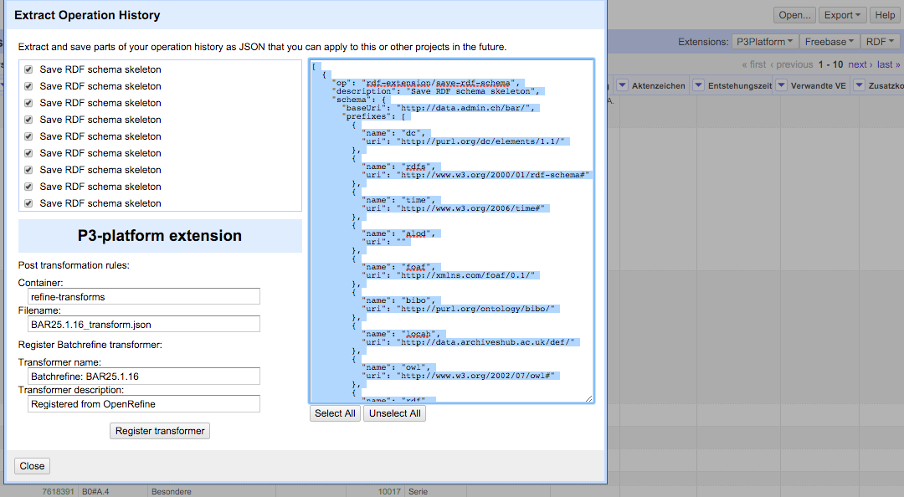

# Swiss Archive Interlinking Use Case

## Background

Since autumn 2014 the Swiss Federal archive and the archives of four cantons (Basel, Geneva, Neuchâtel, Valais) run a common platform and SPARQL endpoint where they experiment with providing archival data as Linked Data.

The goal of the prototype is to understand the requirements and opportunities of providing archival information as Linked Data. The primary goals of the prototype are:

* explore opportunities of Linked Data for archives
* understand the technical requirements for creating and providing Linked Data
* develop "best practices" for publishing archival data as Linked Data
* test the value of integrating data about related topics from multiple, decentralized sources
* with a clear focus on improving ease of access for the users of these archives
* share the know-how with other archives worldwide

In the prototype the focus is on two historical topics found among all involved archives, in particular [Helvetic Republic](https://en.wikipedia.org/wiki/Helvetic_Republic) and the [Act of Mediation](https://en.wikipedia.org/wiki/Act_of_Mediation).

The data itself is provided under a separate (sub-) domain for each particular partner to mimic a decentralized setup. These domains are [data.alod.ch](http://data.alod.ch), [data.ge.alod.ch](http://data.ge.alod.ch), [data.ne.alod.ch](http://data.ne.alod.ch), [data.vs.alod.ch](http://data.vs.alod.ch) and [data.staatsarchiv-bs.ch](http://data.staatsarchiv-bs.ch).

One goal of the prototype is to show that data maintained decentralized can be better searched by providing Linked Data. Currently the user has to search in five different user interfaces and systems to find information. However, interlinking the archival data within each other and with external reference data sets is harder than expected. In most cases the original data does not provide keywords that can be used for interlinking. The only way to currently search in the data set is to search for keywords in short textual descriptions. Additionally to these descriptions there is some basic metadata like what year the entry is from.

For that reason the archivists proposed to interlink the data with external reference data sets like GND (German: Gemeinsame Normdatei, also known as: Universal Authority File). In this use case Fusepool P3 will be used to interlink the descriptions about the archival entry by using an Apache Stanbol enhancer which is providing a GND index. The results will be analyzed by archivists behind the ALOD project to see how it improves ease of access of 
archival data.

## Source Data

Initially we only had a few hundert thousands of sample data sets for the mentioned Helvetic Republic time period. They were transformed to Linked Data using OpenRefine configurations which were done with the stakeholders. Once we started working in Fusepool P3 the archives realized that bulk-processing bigger data sets is just a matter of machine hours as the basic processes are in place anyway. The Swiss Federal Archive then asked us if we could run the process for the whole dump of their public part of the archive, which is around 5 million records (CSV). The data is currently maintained within a private Github repository, it is planned to release it as a public repository later in 2016.

## Transformation workflow

### BatchRefine

The OpenRefine configurations were imported into a Fusepool P3 instance. With the Fusepool P3 extension in OpenRefine we registered them as BatchRefine transformations and created a LDP-Container for posting data into it.

The Fusepool Batch Refine Transformer is used for the conversion of the CSV data to RDF. 

### Information Extraction and GND linking

After the transformation of the CSV data to RDF further processing steps are used to enrich the data. 

For information extraction purposes it is necessary to first create a textual representation of transformed archival resources. This step is supported by the [Literal Extraction Transformer](https://github.com/fusepoolP3/p3-literal-extraction-transformer). 

This transformer allows for the configuration of predicates to be used for the information extraction. The Literal Extraction Transformer collects literal values of those predicates, groupes them by language and sends the concatenated literals to the configured information extraction transformer.

This information extraction transformer needs to support `text/plain` as input and return the extraction results as RDF encoded using the [Fusepool Annotation Model](https://github.com/fusepoolP3/overall-architecture/blob/master/wp3/fp-anno-model/fp-anno-model.md) 
(FAM). 

For the ALOD Use Case the following predicates are used to collect literal values:

* [`dc:title`](http://purl.org/dc/elements/1.1/title)
* [`dc:description`](http://purl.org/dc/elements/1.1/description)
* [`locah:note`](http://data.archiveshub.ac.uk/def/note)

The transformer was also configured to ignore concatenated texts with less as 50 char.

For the information extraction from the concatenated texts the 
[Apache Stanbol Transformer](https://github.com/fusepoolP3/p3-stanbol-enhancer-adapter/tree/master/service) was used. This component allows to use the [Apache Stanbol Enhancer](http://stanbol.apache.org/docs/trunk/components/enhancer/) as Fusepool transformer.

For the Use Case a Stanbol information extraction pipeline ([Chain](http://stanbol.apache.org/docs/trunk/components/enhancer/chains/)) with the following extraction components ([Engines](http://stanbol.apache.org/docs/trunk/components/enhancer/engines/)) where used:

* [Language Detection](http://stanbol.apache.org/docs/trunk/components/enhancer/engines/langdetectengine): The detection of the language is a pre-requirement for every followup NLP processing task
* OpenNLP based [sentence detection](http://stanbol.apache.org/docs/trunk/components/enhancer/engines/opennlpsentence), 
[tokenization](http://stanbol.apache.org/docs/trunk/components/enhancer/engines/opennlptokenizer) and [POS tagging](http://stanbol.apache.org/docs/trunk/components/enhancer/engines/opennlppos). All pre-requirements for Named Entity Extraction (NER).
* [OpenNLP based Named Entity Recognition](https://stanbol.apache.org/docs/trunk/components/enhancer/engines/opennlpcustomner) by using the high quality English, German and Italian [IXA Pipe NERC](https://github.com/ixa-ehu/ixa-pipe-nerc/) models.
* GND Entity Linking and Disambiguation support provided by the [Redlink Semantic Platform](http://redlink.co/semantic-platform/) (for details see next section)

## Redlink GND linking and disambiguation

GND (German: Gemeinsame Normdatei) is a rather big vocabulary with overall more as 11 million entities.
With vocabularies of that size it is rather typically that their are multiple entities that share the same labels.

Within the GND this is especially true for organization (e.g. their are 50+ organizations with the acronym 'CDU') but also for Persons with common Family names the GND typically contains multiple entities. Because of this linking against GND requires to disambiguation.

For the ALOD use case GND linking and disambiguation is provided by the 
[Redlink Semantic Platform](http://redlink.co/semantic-platform/). 

### Redlink Fusepool Integration

The [Redlink Semantic Platform](http://redlink.co/semantic-platform/) is integrated with the Fusepool Platform by the means of the [Redlink Stanbol Engine](https://github.com/fusepoolP3/p3-stanbol-engine-redlink). This
component is included in the default [Fusepool Stanbol Launcher](https://github.com/fusepoolP3/p3-stanbol-launcher/releases).

To make use of the Redlink Semantic Platform within Fusepool a user will first need to create an Account at [https://my.redlink.io/](https://my.redlink.io/).

After creating the account one can create a new Application via the Dashboard. The following figure shows an example application.

The configuration shown in the above figure shows the 

* GND linking + disambiguation component
* Keyword Extraction

After saving the application one needs to not the name (`my-application` for the example) and the application key.

As final step the user needs to configure an instance of the Redlink Stanbol Engine within the Apache Stanbol Instance used by the Fusepool Platform. Stanbol typically runs on port `8304`. The configuration UI can be found at

    https://{fusepool-host}:8304/system/console/configMgr/eu.fusepool.enhancer.engines.redlink.RedlinkEngine        

In this configuration UI one needs to provide a name for the Stanbol Enhancement Engine as well as the application name (`my-application`) and the application key generated by Redlink.

The engine with the name (`my-redlink-engine`) can than be used as any other stanbol engine for enhancement chains. A typical configuration would be the `my-redlink-engine`, `fise2fam` 

_NOTE:_ the `fise2fam` engine is needed by any Enhancement Chain used as Fusepool Transformer, as it translates the Stanbol Enhancement Structure to the [Fusepool Annotation Model](https://github.com/fusepoolP3/overall-architecture/blob/master/wp3/fp-anno-model/fp-anno-model.md) (FAM).

## Batch processing

The 5 million records (available as CSV) were split into junks of 50'000 lines. They were posted to the LDP container by using a custom-made Node.js script. The pipeline then processed the junk and once it was completed, the next junk was posted.

In average there were 10 triples created by line (record) in the CSV. For 50'000 lines of input we in average created 500'000 triples. For the complete use case a bit less than 50 million triples were created. A chunk of 50'000 lines took between 30 and 45 minutes. In total the cumulated processing time was around 60 hours.
 
## Using Results

The results will be used in a second generation of the [data.alod.ch](http://data.alod.ch/) user interface, which will be released in Q3 2016. For that [Zazuko GmbH](http://www.zazuko.com/) worked with archivists and other archive users on user interface mockups, which are now being implemented.

On large scale level evaluation will be done once the new user interface is in place. Random checks on particular records were very positive, almost all GND interlinks were useful and made sense.
